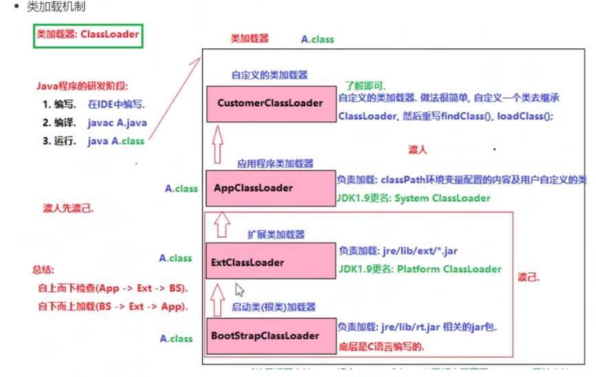
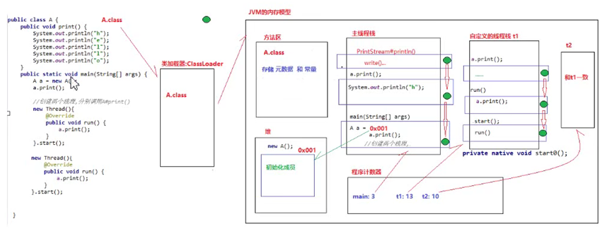
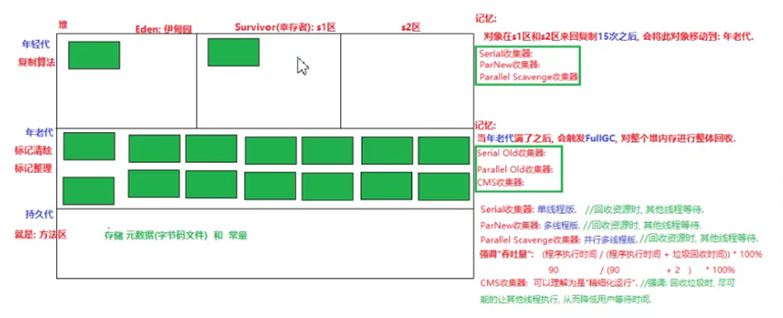
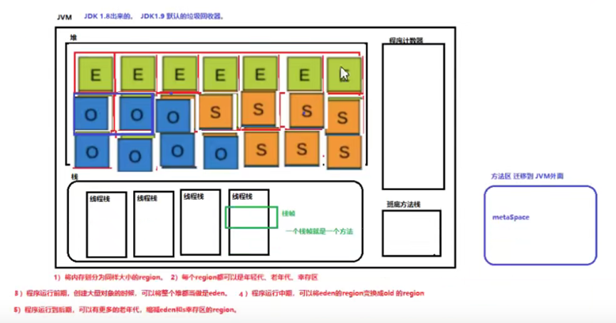

===========================   基础   ===========================

# 一、基础问题
## 1. 关键字
1. static怎么用，final怎么用，static final和final的区别 (字节)
2. 类 和 接口的区别 (京东)
3. 抽象类 和 接口的区别 (京东)

## 2. 基础数据类型

### 2.1. 综合
1. 那java基本数据类型有哪些？
2. java8里面新出了一些时间的类，比如比如LocalDate，与Date、 Calendar等其他时间类有什么区别？(阿里Lazada)
3. Object类有哪些方法？详细说明 (字节飞书)
4. ==与equals区别 (京东)
5. equals和hashcode的概念？以及之间的关系 (蚂蚁)
   1. 重写方法的时候，只重写equals方法，不hashcode重写方***有什么问题？ (阿里Lazada)
6. 取模的时候为什么用&(length-1)
7. 全局变量的缺点，介绍一个小实例 (多益)
8. 你了解函数式接口吗？他有什么作用？解决了什么样的问题？ (百度)
9. 你知道 Java 里面默认的函数式接口有哪些？你用过什么方法里面，会用到函数式接口作为参数？ (百度)
10. Lambda 表达式解决了什么问题？临时的什么对象？为什么创建了这个对象就可以解决问题？这个对象有什么特点？ (百度)
11. 如果没有 Lambda 你怎么做呢？Lambda 写的那个表达式是干什么用的？Lambda 表达式真正的好处在哪？ (百度)
12. 用了 Comparable 接口的排序方法和没用 Comparable 接口的排序方法有什么优点呢？ (百度)

### 2.2. 字符串
1. String, StringBuffer, StringBuilder (华为、蚂蚁)
2. Java中有个String类，如果我们自己写一个java.lang.String类，会出现问题吗 (字节番茄小说)
   - 参考《深入理解Java虚拟机》第7章 虚拟机类加载机制，主要讲了类加载器的种类和双亲委派模型

### 2.3. 数字类
1. 给了个C++的结构体，有char、int等3个属性，问占多少内存，换了个顺序，又问占多少内存 (字节番茄小说)
2. char和byte的区别 (虾皮)
3. int和byte能否相互转换，强制转换会精度缺失 (虾皮)

# 二、Collections !!
1. General
   1. 讲一下java的容器/collections有哪些 (小米、拼多多、京东)
   2. 自己平时看过哪些集合类的源码？ (蚂蚁*2)
   3. 有什么能让你眼前一亮的东西吗？ (蚂蚁)
   4. 看了源码后，在工作中有参考它吗？ (蚂蚁)
2. ArrayList & LinkedList
   1. ArrayList 和 LinkedList 的区别 (美团优选、小米、蚂蚁、OPPO提前批、虾皮、百度、京东)
   2. ArrayList, Vector, LinkedList 对比
   3. 链表 与 队列的使用场景 (多益)
   4. LinkedList的数据结构，为什么是双向链表 (网易云音乐、百度)
   5. 怎么实现一个栈的呢？ (阿里Lazada)
   6. 为什么链表树化需要同时满足链表长度>=8和数组长度>=64两个条件，这样设计的原因是什么？ (拼多多)
3. HashMap (百度提前批、腾讯音乐)
   1. 底层数据结构
      1. 底层数据结构是怎么样的 (美团优选、快手、小米、OPPO提前批、多益、京东科技、有赞、京东)
      2. 底层链表是单向还是双向 (京东科技)
      3. HashMap 底层为什么要用红黑树呢？为什么不用平衡二叉树？ (蚂蚁、虾皮)
         1. 父节点为红，子节点还能是红色吗 (虾皮)
      4. 什么时候退回回链表？为什么不是7 (菜鸟网络)
   2. 扩容机制
      1. 默认容量是多少，啥时候扩容 (携程、美团、美团优选、小米、OPPO、多益、京东科技)
      2. Map：只存60个键值对，需要设置初始化容量吗？设置的话设置多少初始化容量：需要 否则需要多次扩容 128 要考虑数组长度是2的幂次方、负载因子 (菜鸟网络)
      3. 为什么加载因子是 0.75 (多益)
   3. put get过程 (菜鸟网络、有赞)
   4. 遇到key冲突的时候是怎么处理的呢？ (蚂蚁、有赞)
   5. Hashmap 1.7和1.8的区别 (携程)
   6. 假设HashMap里面存放100万个对象，那么gc可能会有什么问题？ (腾讯音乐)

4. 其他Map
   1. Java里的 Map 有哪几种实现  (字节番茄小说)
      - HashMap | TreeMap | HashTable | LinkedHashMap | ConcurrentHashMap
   2. TreeMap 的使用场景，底层数据结构，红黑树的存取复杂度  (字节番茄小说)
   3. LinkedHashMap 的使用场景  (字节番茄小说)
      - 用 LinkedHashMap 实现lru，按插入顺序(默认) accessOrder = false | 按访问顺序 accessOrder = true，HashMap+双向链表
   4. HashSet 和 HashMap之间有什么关系？ (工信部电子五所、蚂蚁)
   5. HashTable 与 HashMap 区别 (有赞)
   6. TreeMap 与 HashMap 区别 (百度)

# 三、封装继承多态
1. java面向对象特点 (华为)
2. 说说多态 (深信服、字节飞书、百度)
3. 重载与重写区别
4. 为什么要有包装类 (多益)

===========================   进阶   ===========================

# 一、多线程 !!!
1. 综合
   1. 说说对并发编程的理解 (深信服、百度)
   2. 什么是线程安全？为什么不安全？ (蚂蚁*2、多益)
   3. 怎么把一个对象编程线程安全 / 一般怎么样才能做到线程安全？ (蚂蚁、拼多多、多益)
   4. 手写：阻塞队列实现、信号量实现 多线程生产者消费者 (美团)
   5. CountDownLatch你知道吗？说一下。信号量呢？ (阿里Lazada、京东)
      - 在什么场景用过，减是用什么方法 (京东)
   6. 线程状态有几种？(美团、华为、工信部电子五所、字节飞书)
   7. 线程间通信的方式，wait-notify (携程、网易云音乐)
   8. 在Java中创建线程有哪几种方式？ (华为、工信部电子五所、京东科技、百度)
      1. Runnable和Callable创建线程有什么区别？ (京东科技)
   9. 如何判断死锁，怎么避免死锁 (多益)
   10. java里面的线程和操作系统的线程一样吗？ (腾讯音乐)
   11. CompletableFuture你知道吗？ (阿里Lazada)
   12. 并发和并行的区别？(字节飞书)
   13. 我一个请求进来，通过隐式方式，在线程内如何隐式的传递uuid (京东)

2. synchronized
    1. 底层实现 (小米、字节飞书、美团)
    2. 在JDK升级中，synchronized是怎么改进的
    3. synchronized 锁升级、锁降级，可重入锁 (有赞、京东)
3. 锁
   1. synchronized 和 lock的区别，lock是公平吗 (携程、京东)
   2. Java 里面的锁有哪些，用过哪些？(京东科技、京东)
   3. ReentrantLock、AQS (美团、小米)
   4. ReentrantLock 的实现原理？(京东科技、字节番茄)
   5. 说说可重入锁、为什么需要可重入锁？ (字节番茄、字节飞书、京东)
   6. Java 有哪些同步方案，如果不加锁呢，加锁会不会太重了 (字节番茄小说)
   7. 一个轻量级锁怎么变成一个重量级锁的呢？ (阿里Lazada)
   8. 项目中锁的应用，分布式锁 (快手)

4. 线程安全 Collections
   1. ConcurrentHashMap
      1. HashMap是线程安全的吗？为什么呢？ (蚂蚁、美团、陌陌、京东)
      2. 如何让 HashMap 线程安全 (蚂蚁、陌陌、小米)
      3. ConcurrentHashMap为什么是线程安全的？ (蚂蚁、拼多多、小米、京东)
         - 通过 cas + synchronized 实现，线程操作前 先判断刚才是否有人在扩容或者在修改这个桶的数据
      4. jdk 1.8里面改进成了CAS 说一下你的理解 (小米)
   2. BlockingQueue
      1. 从可重入锁出发，写出基于可重入锁的阻塞队列，怎么实现 (美团)
   3. 任讲
      1. 有哪些线程安全的集合类，讲一讲原理（HashTable，ConcurrentHashMap，CopyOnWriteArrayList） (美团优选)
5. 原子类、CAS
   1. 说说 volatile 作用和原理？怎么保证可见性的？ (蚂蚁、美团优选、小红书、小米、OPPO提前批、京东科技、京东)
   2. volatile 和 synchronized 区别 (蚂蚁)
   3. 写出volatile解决可见性的代码 (美团)
   4. 用volatile修饰的变量来记录访问次数，需要其他同步操作吗 (字节番茄小说)
      - 从Java内存模型JMM的角度讲volatile，说明指令中的lock前缀和将esp寄存器的值+0这个空操作
   5. 哪些可以保证原子性，CAS做乐观锁吧 (京东)
   6. 说说 CAS (OPPO提前批)
   7. CAS的ABA问题是什么，怎么解决 (字节番茄小说)
   8. CAS失败了怎么办 (小米)

6. 线程池
   1. 介绍下线程池，讲讲为什么要有线程池 和 底层实现的原理 (京东、携程、拼多多、快手、百度提前批、有赞)
      1. 一个任务进来后，线程池是怎么处理的？(京东科技)
   2. 参数及创建方式 (携程、快手、蚂蚁、百度、京东)
      1. 核心线程数与最大线程数之间的关系？(蚂蚁)
      2. 自定义线程池的最大线程数如何设定 (多益)
      3. 拒绝策略 (拼多多、京东科技)
      4. 线程池哪几种？分别说一下 (京东科技)
   3. tomcat的线程模型？tomcat线程池如何实现？(蚂蚁)
   4. tomcat servlet接收请求流程 (有赞)
   5. 线程池会造成 oom 内存泄漏吗？(蚂蚁)
   6. 了解Java的线程池吗？里面有一个ForkJoinPool，有没有用过？说一下 (阿里Lazada)
   7. ForkJoinPool和其他的线程池有什么不一样的地方吗？比如用到了哪些算法 (阿里Lazada)

# 二、设计模式
1. 手写单例模式 (京东、小红书、百度提前批、虾皮)
2. 迭代器模式 (京东)
3. 谈谈设计模式，单例和工厂的使用场景 (携程)
4. 说说工厂设计模式 (阿里Lazada)
5. 知道netty吗 讲一下一个设计模式吧 reactor模式、反应器设计模式 (京东)
6. 动态代理和静态代理的区别 (携程、有赞)
7. 写出装饰者模式和策略模式代码 (美团)
8. 为什么内部类能访问到外部类的私有属性 (百度提前批)
9. 设计模式的六大原则 (多益、京东)
10. 模板模式怎么用 (京东)
11. Spring 中用到哪些设计模式 (京东)

# 三、JVM
1. 有没有用过工具，怎么查看Java堆的统计信息 (字节番茄小说)
2. Linux如何查找有多少个error的命令  (陌陌)
3. JVM执行参数 (多益、虾皮)
4. JVM 内存空间 
   1. JVM内存空间分布 (美团优选、小米、蚂蚁、百度提前批、京东科技、有赞)
      1. 为什么他要这么设计 (蚂蚁)
   2. 说说ThreadLocal 和 ThreadLocal内存泄漏 (携程、京东*2)
   3. 为什么要用弱引用？ (京东)
   4. 对象头、markword (美团)
   5. 内存泄漏、内存溢出的场景 (京东)
5. JAVA 类加载过程 (百度提前批、京东)
   1. JAVA类加载过程 (菜鸟网络)
   2. 类加载器、类加载机制、准备和初始化在干什么 (美团)
         
         
   3. 我用一个boolean的变量，准备阶段是把它赋值成true了吗? 这个变量从准备阶段由false变为true会造成什么问题? (京东)
6. GC (百度提前批)
   1. 了解JVM吗？为什么需要垃圾回收呢？ (蚂蚁*2、携程、菜鸟网络、腾讯音乐)
   2. 常用的GC算法、垃圾回收器有哪些 (蚂蚁*2、美团、美团优选、顺丰、多益、腾讯音乐、字节飞书、虾皮、有赞)
   
   3. JVM怎么判断一个对象是否是垃圾对象？ (蚂蚁、腾讯音乐)
   4. CMS的过程？怎么标记垃圾的？三色标记法？G1的区别？ (美团、蚂蚁、美团优选)
   5. CMS什么时候会STW？为什么要STW? (美团)
   6. JVM新生代和老年代垃圾回收的方式 (网易云音乐)
      1. yong GC 的发生时间？发生频繁，发生时间长的原因和解决方案？ (美团)
      2. 什么情况下老年代会发生GC？ (蚂蚁)
   7. 哪些可以作为GCroot (美团优选、有赞)
   8. 计算机性能好 但Idea（也是一个Java程序）但比较卡，原因：可能是因为频繁产生Full GC 怎么排查问题进行调整 (菜鸟网络)
   9. Full GC效果不好 每次只能从90%-》85%之后又90%了，这种情况下应该怎么办比较好 (菜鸟网络)
   10. 如果GC突然很慢怎么排查，比如原来GC完成只需要1秒，现在要5秒？了解哪些gc相关的工具，比如jstack之类的 (字节飞书)
   11. Java如何进行手动垃圾回收 (顺丰)
   12. 如何判断对象是否死亡 (多益)

7. JDK1.8

   - 每个region都可以是不同的代
   - 优化：提高内存利用率，例如一开始在JDK1.7的年老代是空的。减少GC次数
8. 介绍一下JMM (京东)

===========================   恶魔问题   ===========================

# 一、Java
1. JDK与JRE区别 (华为)
2. jdk 和 cglib的区别？(美团)
3. Java为什么被称为平台无关性语言？(蚂蚁)
4. 有什么语言也能够实现跨平台 (多益)
5. 你平时在Java技术方面，对哪些方面了解比较透彻？(蚂蚁)
6. java 8,9,11的新特性 (携程、蚂蚁)
7. try catch会影响性能吗？为什么抛出异常的时候会影响性能？ (百度提前批)
8. spi了解吗 (京东)

# 二、业务问题、情景
1. 项目部署到Linux服务器后，cpu飙到100%了，怎么去排查？ (蚂蚁)
2. 项目支付模块，退单怎么处理？消息丢失（RabbitMQ怎么做)？ (携程)
3. 项目问题，排查思路 (快手)
4. 简历上的项目可以怎么优化 (顺丰)
5. 如果出现客户端假死情况？是否做了用户的鉴权判断？ (蚂蚁)
6. 服务端的推送，客户端和服务端分别需要注意什么 (蚂蚁)
7. 那如果我这边请求很多（高并发），可能会打爆服务，那该怎么设计？ (蚂蚁)
8. 如果让你设计一个rpc框架你会如何设计？ (蚂蚁)
9. 有1亿用户和1亿短视频，设计一个实时的日排行榜，展示top100个热门视频，热门视频的统计方法为统计视频的实时观看用户数，根据用户数排行 (腾讯音乐)
   - 设计方案后还要求计算使用多少内存
10. 为什么现在很多公司的服务都要上云呢？ (阿里Lazada)
11. 商家入驻抖音电商需要缴纳一笔保证金，设计一个系统，记录商家缴纳的保证金及相关信息，缴纳的保证金可以修改，比如商家入驻第一年缴纳5w，第二年为10w，不同商家缴纳的保证金是不同的。(字节抖音)
12. 一个岛上有三种颜色的兔子，假设是a（红色）、b（蓝色）、c（黄色），两两碰撞会变成第三种颜色，比如 a、b碰撞就会变成c，问：a、b、c满足什么样的数量关系，在经过足够长的时间后，才能使得岛上的兔子只有一种颜色。给6分钟时间思考。 (字节国际化电商)
13. 设计论坛系统的评论功能 (字节番茄小说)
14. 用户角色权限设计 (有赞)
15. 输错密码锁定用户功能 (有赞)

# 三、综合
1. 如果让你作为面试官，你问我一个比较深入的问题，你会问什么呢？(蚂蚁)
2. 你对什么技术有沉淀或者学习收获?/ 你有什么擅长点没有被问到，讲一下 (网易云音乐)
3. 除了Java以外的技术有了解过吗？比如机器学习之类的 (京东科技)

# 四、其他
1. 有四扇门 ABCD， 小明在四扇门后面的概率分别为 10%，30%，30%，30%，小明不在 B 门后面，请问小明在 D 门后面的概率 (字节)
2. 1000瓶毒药里面只有1瓶是有毒的，问需要多少只老鼠才能在24小时后试出那瓶有毒。 (腾讯音乐)

===========================   其他   ===========================

# 其他
1. 序列化和反序列化 (小红书)
2. 操作系统级别的io模型，说了些概念知识，java中哪些io模型有用过的 (蚂蚁)
3. git怎么会回滚到上个版本 (陌陌)
4. python 元组和列表的区别 (陌陌)
5. python的垃圾回收 (陌陌)
6. 那我们连接可能要断开，这种如何保证连接的可用性？基于netty心跳来实现 (蚂蚁)

# 算法编程题
1. 未做过
   1. 给你一个正整数数组，求出每个元素和后面第一个值比它大的数字之间的间隔
   2. 给二叉树多一个兄弟节点 (陌陌)
   3. 老鼠试毒 (小鹏、腾讯音乐)
   4. 系统设计（设计一个数据结构实现O1复杂度内完成insert，remove，getRandom() 操作） (字节)
   5. 洗牌算法
   6. 首先输入一个二维数组 例如 [[1,2],[2,3],[2,4]]，表示1和2、2和3、2和4有关系，关系可以传递，所以 1和3、1和4、2和4也有关系 ,输入两个数 比如 1、3，如果这两个数有关系则输出true、否则输出false (字节番茄小说)
   7. 输入一个字符串，至多删除一个字符，该字符串是否是回文串，输出true或者false。比如bab，输出true；babb，输出true (字节飞书)
   8. LeetCode 75 颜色分类 (百度)
2. 不熟
   1. 二叉树中给定值的路径
   2. 排序 
      1. 非递归快排 (陌陌)
      2. 排序算法哪些是稳定的，稳定性体现在哪？(虾皮)
      3. 冒泡排序，写完再问如何优化 (虾皮)
      4. 二分查找 (顺丰、腾讯音乐)
      5. 归排，快排，堆排的应用场景；快排如何实现稳定？ (陌陌)
      6. 说说快排的思想 (京东科技)
   3. 最长子序列的最大和 (陌陌)
   4. 一天内，时针和分针会重合几次 (陌陌)
   5. 链表相加 (快手)
3. 熟悉
   1. 层次遍历 (深信服)
   2. 怎么判断链表有环？怎么找到环的入口？说思路 (京东科技)
   3. 动态规划和贪心算法的区别 (有赞)