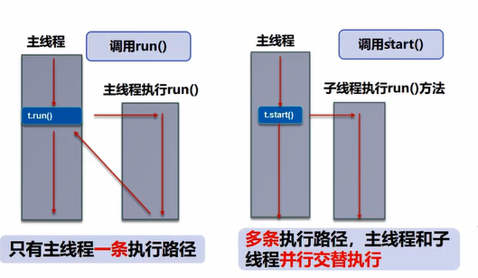
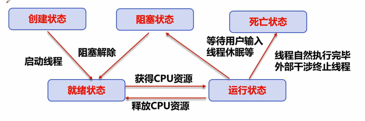

# 一、多线程基础

## 1. 线程和进程
- 程序是一堆代码和数据的集合
- 一个进程是程序的一次执行，是系统分配资源的最小单位
- 进程中可以包含多个线程，但至少有一个，否则没有意义。是CPU调度和执行的单位  

注：很多多线程是模拟出来的，真正的多线程是指多核。如果CPU的核数不够，模拟出来的多线程会在线程间快速切换，模拟出多线程的效果

- java程序中即使没有创建线程，后台也会有主线程和gc线程，由调度器负责调度的，与操作系统紧密相连 不能人为干预
- 开辟新的线程会带来额外的开销，例如CPU调度时间

## 2. 实现

### 2.1. 继承 Thread 类 (重点)
1. 使用：继承 Thread -> 重写run() -> run()/start()启动


- 直接调用run会串行执行；start方法 会并行执行，时间片抢夺

### 2.2. 实现 Runable 接口 (重点)
1. 使用：实现Runable接口 -> 重写run方法 -> 丢到new Thread()里面 -> start()启动
2. 使用：实现Runable接口 -> 重写run方法 -> 向线程池提交

- 与 Thread 对比，避免单继承局限，可以多个线程操作同一个(实现 Runable 接口的)对象，但没有返回值
- 可以在实现类的 Constructor 传参
- 在匿名内部类里面可以调用外面的 方法或者函数

### 2.3. 实现 Callalbe 接口 (了解)
1. 使用：实现Callalbe接口 -> 重写call方法 -> 向线程池提交
- 与 Runnable 的区别：可以有线程执行结果输出


### 2.4. lambda
- 局部内部类：class写在main方法(调用方法)里
- 匿名内部类：class写在main方法(调用方法)里，且直接 new 接口名，不需要类名
- lambda: 优化函数式接口（只有一个抽象方法）的语法
```java
// 单个参数时(i)可以简化成i, 参数类型可以不写 ; 2. 方法体中单条语句时，可不写{}
new Thread( (i)-> {
    System.out.println("线程休息:"+i);  
},"thread_name").start();
```

### 2.5. 线程池
```java
ExecutorService executorService = Executors.newFixedThreadPool(3); // 线程数量
// 提交执行
Future<Boolean> result1 = executorService.submit(new Callable()); // 可以放Callble接口的实现类 或者 Runnable
Future<Boolean> result2 = executorService.submit(new Callable()); // 如果放Runnable就没有输出
Future<Boolean> result3 = executorService.submit(new Callable());

System.out.println("" + result1.get() + result2.get() + result3.get());

executorService.shutdownNow(); // 关闭线程池
```

### 2.6. FutureTask
```java
FutureTask ft = new FutureTask(new Callable()); // 用Callable接口 创建一个 FutureTask

new Thread(ft, "name").start(); // 利用 FutureTask 运行一个线程

ft.get(); // 获取 Callable 的执行结果，可能会产生阻塞
// 实践中 把他放到最后 或者 用异步通信

```

## 3. 线程状态

### 3.1. 线程状态
- NEW: 创建未start() or run()
- RUNNABLE: 被 thread.start()，等待被执行 争夺时间片
- BLOCKED: 被锁 阻塞等待
- WAITTING:  在等待另外一个线程执行特定动作，wait()
- TIME_WAITING: 在等待另外一个线程在特定时间执行特定动作，sleep wait
- TERMINATED

### 3.2. 线程命令
- thread对象.setPriority(): 1-10, 越高越容易抢到
- Thread.sleep(): 不能释放锁
- Thread.yield(): 让当前线程礼让重新和其他线程抢夺时间片，但是否能优先抢到要看CPU调度分配 
- thread对象.jion(): 强行插队，并且得让thread对象执行完，其他线程才可以继续开工
- thread对象.isAlive(): 检测是否活着

```java

```

### 3.3. 线程停止
- thread对象.interrupt(): 中断, 不建议使用stop or destroy等过时方法,
- 用flag和while(flag)的死循环

```java

```

### 3.4. 守护线程
- jvm无需等待 守护线程完成，只要用户线程处理完就会关闭
- 如，操作日志，监控内存，垃圾回收等
- thread对象.setDaemon();


# 二、synchronized

## 1. 多线程冲突
- 多个线程对同一个对象进行操作，如果不加锁会造成写入丢失、脏读、幻读、不可重复读的问题

## 2. synchronized 关键字使用
- synchronized 修饰的对象，当有线程在操作，其他线程想操作的话就等挂起等待
- 如果锁整个对象，且对象里面还有其他的属性需要被操作，效率不高
  - synchronized 加在普通方法前面，锁的是对象
  - synchronized 加在 static 方法前面，锁的是.class 
  - 上述两者 用的不是同一把锁

## 3. synchronized 关键字使用
- 性能问题：
  - 加锁和释放锁会导致较多的上下文切换和调度延时
  - 一个优先级高的线程等待一个优先级低的线程释放，会导致优先级导致的问题

## 4. 生产消费

### 4.1. 线程间通信
- notify()-唤醒 和 wait()-等待
- wait会释放锁 sleep不会

## 5. 虚假唤醒问题 待详细学习
- 如果有多个线程在wait()，一个线程去notify()的话，使用if判断会出现虚假唤醒问题
- 官方：用while代替if，wait()应该出现在循环中


# 三、Lock 锁

## 1. Lock 与 synchronized 对比
1. 废话
  - Lock 是java类、 只能锁代码块，synchronized 是内置关键字、可以锁代码块 和 方法
  - Lock 是显式锁 开了得关闭，synchronized 是隐式锁 出了作用域自动释放  
2. 重要
  - Lock 比 synchronized 花费更少的时间来调度线程，性能更好
  - Lock 有更好的拓展性（提供更多子类）
  - 在 BLOCKED 情况下，Lock 可以尝试 lock.tryLock() 获得锁，synchronized 产生的阻塞就只能一直等
  - Lock 可以判断锁，而 synchronized 是不可中断的
  - Lock 可以自定义，而 synchronized 只能是非公平

## 2. ReentanceReadWriteLock 可重入读写锁
1. FairLock 公平锁：先来后到, NonFairLock 非公平锁：可以插队（默认）
2. try { lock.writeLock.lock(); } finally { lock.writeLock.unlock(); }
3. 写锁 = 排他锁，读锁 = 共享锁
4. 锁得粒度更细

## 3. Condition - Lock 的通信
- 与 synchronized 下的 notify 相似， 充当 Monitor
```java
Condition condition = lock.newCondition();
condition.await();
condition.signalAll();
```
- 用多个condition 也可以 也可以定向唤醒，使其按照执行顺序执行
- 适用于流水线一样的处理
```java
condition.signal();
```


# 四、Java 类 (必会)

## 1. Collections

### 1.1. CopyOnWriteArrayList
ArrayList 线程不安全（多个线程同时修改，会发生覆盖数据的情况）的解决方案：
1. new Vector();
2. Collections.synchronizedList(new ArrayList());
3. new CopyOnWriteArrayList();
    - 使用 transient 修饰
    - 使用 lock锁 相比 Vector 使用 原始的synchronized 修饰要高效

### 1.2. CopyOnWriteArraySet
- 同样是用来解决 HashSet 的线程不安全问题
- btw，HashSet 底层还是用 HashMap 实现

### 1.3. ConcurrentHashMap
- 使用分段锁技术，使程序需要修改里面的 Entry/Node 的时候不用把所有数据都锁住

### 1.4. BlockingQueue 阻塞队列
|操作类型 | 抛异常 | 不抛，有返回值 | 阻塞等待 | 超时放弃 |
| :---:| :---:| :---:| :---: | :---: |
| 增         | add()     | offer()  | put()  |  offer(值, 秒数, TIME.SECONDS)   |
| 删         | remove()  | poll()   | take() |  poll(秒数, TIME.SECONDS)       |
| 是否队列头  | element   | peak     |   -    |  -                              |

### 1.5. SynchronousQueue 同步队列
- 没有容量，进去一个元素，必须等待取出来之后，才能再往里面放一个。
- 存put(), 取take()

## 2. Atomic
### 2.1. AtomicReference
- 利用 AtomicReference 保证值的 visibility，
- 修改值的时候用 compareAndSet 一直跟 expect 的原值对比，如果一样就修改，不一致的话就在循环中再来一次
- 在并发修改值的时候保证不会造成 write-write conflict，CAS 可以尽可能地缩小锁的范围 增强并发性能
- https://www.bilibili.com/video/BV1B7411L7tE?p=38

## 3. Auxiliary 辅助类 
### 3.1. CountDownLatch 计数器(-1)
- 用await()阻塞，等所有线程都执行完再执行下面的代码
- 在线程方法体底部用 countdown() 减1

### 3.2. CyclicBarrier 计数器(+1)
- 凑齐一定数量的线程就执行方法体里面的代码

### 3.3. Semaphore
- 限流, 控制最大线程数 


# 五、线程池 (重点)
- 作用：减小对于线程开启、调度、关闭的系统资源开销，达到线程复用的效果

## 1. 三大构建方法 (不建议)
```java
ExecutorService threadPool_1 = Executors.newSingleThreadExecutor(); // 单个线程
ExecutorService threadPool_2 = Executors.newFixedThreadPool(3);     // 固定大小的线程池
ExecutorService threadPool_3 = Executors.newCachedThreadPool();     // 可伸缩线程池
threadPool_1.shudown();
```

## 2. 七大参数
- 阿里巴巴开发手册：要求使用ThreadPoolExecutor创建线程，并熟悉参数
```java
public ThreadPoolExecutor(  int corePoolSize,           // 核心线程池大小
                            int maximumPoolSize,        // 最大核心线程池大小
                            long keepAliveTime,         // 超时多久没人调用就会释放
                            TimeUnit unit,              // 超时单位
                            BlockingQueue<Runnable> workQueue,  // 阻塞队列
                            ThreadFactory threadFactory,        // 线程工厂 不用动
                            RejectedExecutionHandler handler)   // 拒绝策略
```
- 阻塞队列满了，就会继续开启线程，直到线程数达到 maximumPoolSize
- 平时就按照 corePoolSize 数量开启线程数

## 3. 四种拒绝策略
- 当线程池满了
```java
new ThreadPoolExecutor.AbortPolicy();           // 报错
new ThreadPoolExecutor.CallerRunsPolicy();      // 让caller去执行 (main线程)
new ThreadPoolExecutor.DiscardPolicy();         // 丢掉任务，不抛异常
new ThreadPoolExecutor.DiscardOldestPolicy();   // 尝试和最早的竞争，不抛异常
```

## 4. 总结

### 4.1. 设置最大线程数
1. CPU密集型
- CPU核数
```java
Runtime.getRuntime().availableProcessors();
```
2. I/O密集型
- 通常最大线程数 = 十分耗IO的任务 * 2


# 六、 高级
- JDK5时代：泛型、枚举、反射
- JDK8：lambda表达式、链式编程、函数式接口、Stream流式计算

## 1. 函数式接口
- 可以用lambda表达式简化代码
```java
// Function 工具类：输入一个值，计算出一个值
Function function = new Function<String,String>(()->{
    @Override
    public String apply(){
        return String;
    }
})
            
// Predicate 断言类：输入一个值，判断出一个boolean
Predicate predicate = new Predicate<String>(()->{
    @Override
    xxx
})

// Consumer 消费类：有输入，没有输出
Consumer consumer = new Consumer<Integer>(()->{
    @Override
    public void accept(Integer i){
        xxx 业务代码
    }
})

// Supplier 生产类：没有输入，有输出
Supplier supplier = new Supplier<Integer>(()->{
    @Override
    public Integer get(){
        xxx 业务代码
    }
})
```

## 2. Stream流式计算
```java
List<User> users = new List();
users.add(xxx);

// stream流式计算 + 链式编程 + 函数式接口 + lambda
users.stream()
        .filter(u->{u.getId() % 2 == 0;})           // filter( Predicate )
        .filter(u->{u.getAge() >= 25 == 0;})
        .map(u->{u.getName().toUpperCase();})       // map( Function )
        .sort((u1,u2)->{u2.compareTo(u1)})          // sort( Comparator )
        .limit(1)                                   // 限制个数
        .forEach(System.out::println)
```

## 3. forkjion
- 把计算任务分成几个小分支，再合并结果
- 工作窃取：自己的任务完成了之后去做别人的任务，优化效率

## 4. CompletableFuture 异步请求
```java
b_Asyn
```

## 5. 内存相关 (高级)

### 5.1. volatile
1. 保证可见性
  - JMM java内存模型，是一种概念和约定
    - 前程解锁前，必须把共享变量立刻复制到贮存
    - 线程枷锁前，必须到主存中获取最新值到工作内存中
2. 不保证原子性
   - 不适用synchronized 和 lock， 还可以使用JUC下面的原子类(AtomicInteger)
   - 原子类底层使用CAS技术，和操作系统挂钩，在内存中修改值，Unsafe类是一个很特殊的存在
3. 禁止指令重排
    - 我写的程序，计算机并不是安装我写的顺序执行的
    - 编译器优化的重排，指令并行也可能会重排，内存系统也会重排
    - 多线程的情况下，重排会影响计算结果，出现不可重复读的情况

### 5.2. 单例模式
- 懒汉模式：里面属性对象需要的时候再生成 
- 饥饿模式：类一建立，里面属性对象就生成 
- 静态内部类 
- 单例不安全因为有反射，但不能破坏枚举，枚举没有无参构造器

### 5.3. CAS: CompareAndSet(expect, update)
- 比较工作内存和主存中的值，如果和expect一致就执行更新操作，否则就一直死循环（自旋锁）
- Unsafe 是java 调用c++操作内存的工具
- 缺点：
  - 循环会耗时
  - 一次只能保证一个共享变量的原子性ABA问题
  
### 5.4. ABA问题 
- 狸猫换太子：两个线程在同时修改一个东西，发生write-write错误
- 使用new AtomicStampReference<>(initRef, initialStamp)，initialStamp相当于版本号，每次修改都需要更新版本号
- 更改atomicStampReference.compartAndSet(expectedRef, newRef, expectedStamp, newStamp);
- 大坑：-128~127 的int 是由Integer.cache产生的，以外可能会产生不相等，都得使用.equal()


## 99. 学校项目笔记
1. synchronized 基本不用，都是很原始低效保证线程安全的方法
2. Lock 会用在一些 concurrent collections or atomic type of data里面，但不会直接使用程序里面
3. Atomic 类使用CAS的方法来避免线程冲突的问题
