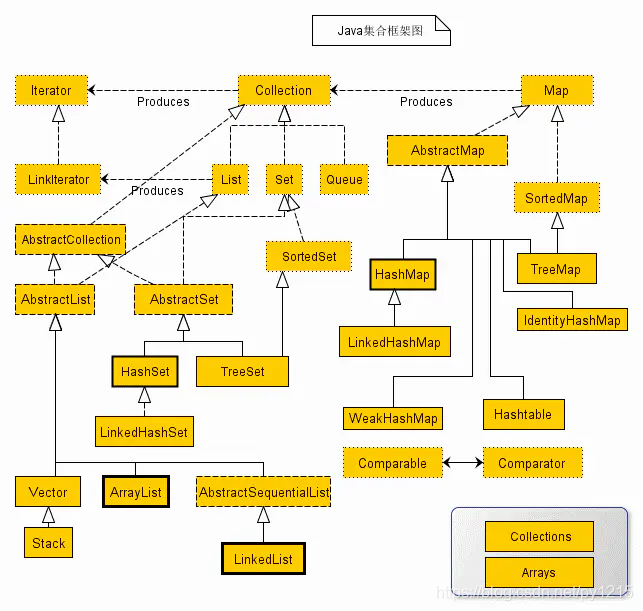
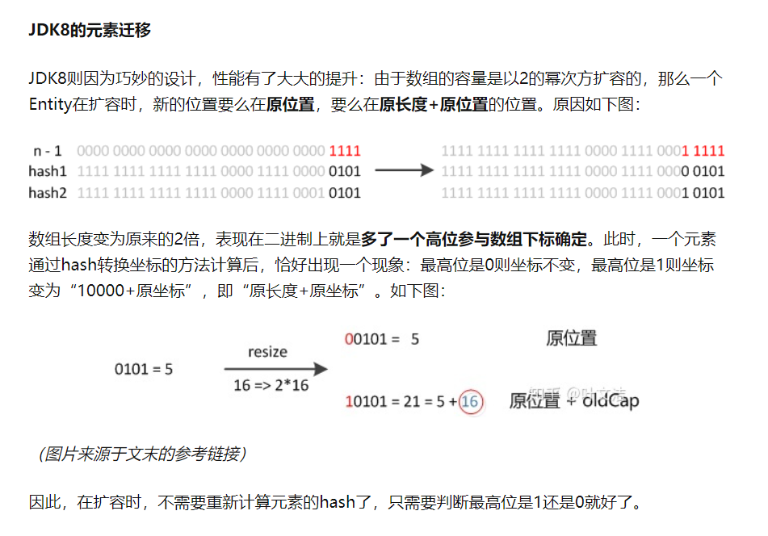
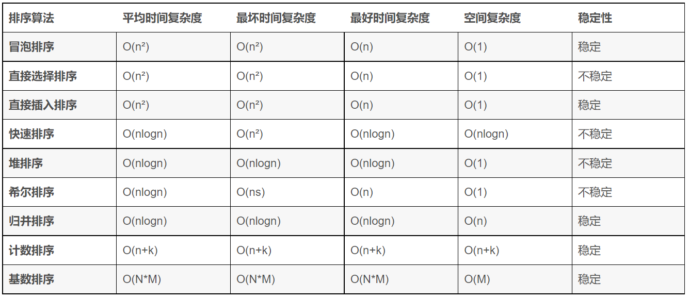
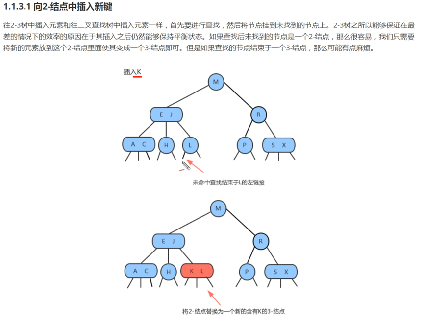
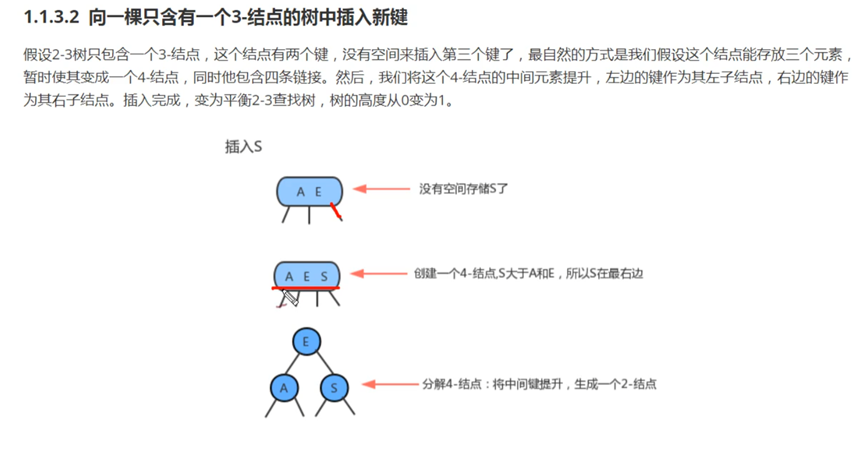

===========================   沉下心来背好基础题目，一票否决 必须熟练   ===========================

# 一、Basic Questions
[基础和三大特征](https://blog.csdn.net/qq_22118507/article/details/51422591)
## 1. 关键字
1. static怎么用，final怎么用，static final 和 final的区别 (字节)
> static 静态会让修饰的变量和方法存在类模板里面，可以直接类型.属性/方法进行调用
> final 让修饰的变量不能修改值和指向的内存地址、不能继承或重写
> 有没有 static 修饰的区别在于，该变量是否只有1份存在类模板中，还是存在于每个实例中

2. 类 和 接口的区别 (京东)
> 类 可以是高度抽象的实体 或者 是实际实现功能的子类，只单继承一个父类
> 接口 通常是一些通用功能的抽象，例如comparable，可以实现多个接口。
> 接口中的属性都是默认public final static的，可以理解成都是常量 例如π；另外方法只能是抽象方法：不可以有方法体，即不能有具体实现，只能用public或者protected或者没有修饰，不能被final，static，private修饰

3. 抽象类 和 接口的区别 (京东)
> 接口的特点如上
> 抽象类中 方法和属性可以是抽象 也可以是非抽象的，还可以有构造方法
> 两者都不能实例化，需要靠子类/实现类来实例化。都需要子类/实现类实现所有抽象方法
> 拓展：接口间可以继承多个接口，不能实现 因为接口不能实现方法，且可以上下转型

4. 访问权限控制
> private: 私有，类内部才能访问
> (default): 同包下可访问
> protected: 仅类内部和子类可以访问
> public: 共有，任何地方都可以访问

## 2. 其他
1. Object类有哪些方法？详细说明 (字节飞书)
> finalize() 当垃圾回收器确定不存在对该对象有更多引用的时候，即回收前会调用该方法
> getClass() 返回当前对象的真实类型
> hashCode() 返回哈希码，决定了对象再哈希表中的存储位置，不同对象的存储位置是不一样的
> equals(Object obj) 比较是否相同，默认比较哈希值
> toString() 打印，默认情况下打印的是对象的十六进制的hashCode值
> 还有多线程中的使用的 notify 唤醒当前对象监视器的任一个线程；wait 暂停当前线程 释放锁，可以设置三个不同参数方法 (等待多少毫秒,额外等待多少毫秒,一直等待)
> clone 

2. equals 和 hashcode的联系？以及之间的关系 (蚂蚁)
> Object 类的 equals() 默认按照 == 来比较 如果没有像String那样进行重写
> hashcode 理应执行多次结果不变，在 equals 方法所涵盖的对象属性没有修改的情况下
> 另外，hashCode 不等的两个对象 equals 一定不相等，但是 hashCode 相等的两个对象 equals 不一定相等
[equals和hashCode的区别和联系](https://www.jianshu.com/p/5b7fe120bf94)

3. 全局变量的缺点，介绍一个小实例 (多益)
> 虽然吧变量写成全局很爽，可以在类里面任何地方访问，内存地址固定读写效率搞
> 但也有以下缺点：
>     1.只要程序不结束，内存不释放
>     2.降低程序的移植性
>     3.一个全局变量可能会出现程序中的各个环节，在一个函数里面修改了该值，可能会影响到其他函数的使用
>     4.多线程环境下同时操作一个全局变量 有可能发生冲突

- 函数式编程
[函数式编程 - 百度有详细的定义](https://baike.baidu.com/item/%E5%87%BD%E6%95%B0%E5%BC%8F%E7%BC%96%E7%A8%8B/4035031)
[函数式编程 - 设计模式中的简化](https://juejin.cn/post/7056354222689746974)
> 函数式编程的开发动机是为了**处理运算**（computation），不考虑系统的读写（I/O）不考虑过程
> 在jdk1.8 新引入stream, lambda 和 函数式接口，让java可以实现**指令式编程**，更关注函数要实现的动作 而不是具体实现的语句
> 通过：
>     1.将数据的公用操作 抽象出来作为函数式接口，如Predicate判断 和 Function计算
>     1.支持函数作为第一类对象，可以被当做对象当做另一函数的输入或输出
>     3.结合 Lambda 表达式 可以简化其书写
> 从而实现 只用"指令"，不用"语句"
> 函数式编程带来的**好处**有以下: !!
>     1.结合 Lambda 表达式 可以简化其书写
>     2.把数据的筛选判断、映射计算、消费、生产 等等动作抽象出来之后，指令式的代码 更接近自然语言，直观地知道要做什么，而不关注怎么实现
>     3.更为简洁的代码，方便代码的调试和管理
>     4.在并发编程里面，不需要考虑并发冲突，因为它不修改变量
>     5.函数式编程对热部署更友好，在不需要使用全局变量之后，只要接口方法名字一样就可以实现热部署，接口的实现内部和外部无关

4. 你了解函数式接口吗？他有什么作用？解决了什么样的问题？ (百度)
> 1.8新出的函数接口只有一个方法的接口，被@FunctionalInterface 修饰，我认为他解决了函数式编程中 **数据操作接口统一**的问题
> 因为 如果像jdk1.8设计的，将数据的公用操作 抽象出来作为函数式接口，如Predicate判断 和 Function计算
> 那在设计流式计算的时候就可以通用这个共有的接口，具体操作由程序员自由实现

5. 你知道 Java 里面默认的函数式接口有哪些？你用过什么方法里面，会用到函数式接口作为参数？ (百度)
> Function 计算函数 用 apply() 获取指定类型的结果，用在stream.map() 里面进行计算数据
> Predicate 断言 通过重写 test 方法里面的判断 返回boolean，用来在stream.filter() 里面筛选数据
> Consumer 用 accept() 消费者数据，用在stream.foreach() 里面消费数据
> Supplier 用 get() 产生数据
> Comparator 用 compare() 方法实现两个指定类型实例的比较逻辑
> Runnable Callable 用来开启一个线程，区别在后者有输出，都可以放在线程池里面 进行提交

6. Lambda 表达式解决了什么问题？临时的什么对象？为什么创建了这个对象就可以解决问题？这个对象有什么特点？ (百度)
> Lambda 表达式 本身是一个**匿名函数**，没有方法名的，为了解决 java **函数式接口实现代码冗长**的问题
> 通过简化的代码形式实现，不需要写明参数类型和输出类型，重写方法的名字和访问权限都是不需要的，如果只有1行代码还可以省掉花括号

7. 如果没有 Lambda 你怎么做呢？Lambda 写的那个表达式是干什么用的？Lambda 表达式真正的好处在哪？ (百度)
> JDK8以前没有 Lambda 也没有函数式接口，通过一个完整的类重写抽象方法 来实现接口功能，lambda表达式 为了简化匿名内部类而生
> 当很多行代码 简化 1行之后，不需要创建变量，就可以带来上述 函数式编程的好处4点

8. 用了 Comparable 接口的排序方法 和 没用 Comparable 接口的排序方法有什么优点呢？ (百度)
> 如果不用 Comparable 可以实现一个 Comparator 外部比较器，使用策略模式，即不改变对象自身，而用一个策略对象（strategy object）来改变它的行为
>     将比较这个动作单独抽离出来一个接口，允许不同的类去实现各自的比较逻辑，拓展性更好 更灵活。
>     适用于比较策略不止一个的场景，比如 员工可以按照工龄 也可以按照职级来比较
> Comparable 接口，所以这个公共的功能抽离出来，统一了 Object 进行比较的方法名，通用与很多需要排序的地方，例如TreeMap TreeSet 或 Collections.sort()，默认调用 对象.compareTo方法来进行对比
>     使用与比较策略少变，因为其相对更简洁 所以更通用

# 二、数据类型 !!

## 1. 综合
1. 那 java 基本数据类型有哪些？ (字节番茄小说)
> 二进制byte，字符有 char，数字有 short int long float double，布尔 boolean
> 占用的字节数从小到大：byte(1) < boolean(1) < char(2) < short(2) < int(4) < long(8) < float(4) < double(8)
> 任意一个 float 容量都比整数型大，即使long占8个字节

2. java8 里面新出了一些时间的类，LocalDate，与Date、 Calendar等其他时间类有什么区别？(阿里Lazada)
> Data 精确到毫秒，月份从0开始。因为太难用，且线程不安全的，现在通常都通过Calendar or LocalDateTime来对时间进行操作
> Calendar 日历对象，可以设置时区
>     可以Calendar.getInstance（）或 创建内部类Builder 的实例，通过调用其 build（）方法创建 Calendar 实例
> java8 新增线程安全的类 LocalDate, LocalTime, LocalDateTime，可以通过 LocalDate.now() or LocalDate.parse("2016-12-31") 来创建
>     Local类 和 String一样，不能修改

## 2. 字符串
1. String, StringBuffer, StringBuilder (华为、蚂蚁)
> String 底层 Char[] 储存 用final修饰不可修改。需要重新赋值只是让他指向另一个String对象
> StringBuffer 和 StringBuilder 底层虽然也是 Char[] 储存，但没有final修饰，是动态扩容的
> Buffer 从JDK1.0 线程安全 但效率低, Builder 从1.5开始 线程不安全 但效率更高

2. char 和 byte 的区别 (虾皮)
> byte 是一个字节 有符号的，可以存储 -128~127
> char 两个字节 (16进制Unicode字符)，没有符号 可以存储0~65535，可以存中文
> char、byte、int 对于英文字符，可以相互转化

3. int 和 byte 能否相互转换 (虾皮)
> 强制转换会损失精度，但可以用byte[4] 来表示 int，通过位运算来计算出4个byte的值
> [int 和 byte[]转换 ](https://blog.csdn.net/qq_37909141/article/details/108549012)

4. Java中有个String类，如果我们自己写一个java.lang.String类，会出现问题吗 (字节番茄小说)
    - 参考《深入理解Java虚拟机》第7章 虚拟机类加载机制，主要讲了类加载器的种类和双亲委派模型

# 三、Collections !!
1. General

   1. 讲一下java的容器/collections有哪些 (小米、拼多多、京东)
   > List: ArrayList，LinkedList 除了链表还可以作为 Stack 和 Queue 来使用
   > Set: HashSet, TreeSet
   > Map: HashMap

   2. 自己平时看过哪些集合类的源码？ (蚂蚁*2)
   > ArrayList, LinkedList, HashMap
   > 线程安全的集合 ConcurrentHashMap 和 BlockingQueue

   3. 有什么能让你眼前一亮的东西吗？ (蚂蚁)
   > LinkedList 实现了Dequeue接口可以操作头尾数据之后的使用很灵活，可以被作为栈、队列、单向链表、双向链表来使用，场景很广
   > 可重入的设计 和 HashMap检索首先看桶的头结点 再开始遍历后面的节点，我在编码的时候也会做同样的操作
   > 看线程安全 Collections 的源码，我了解到其实达到线程安全有几种常见策略
   >     然后CAS+volatile更适用于并发竞争不是太激烈的场景，Lock 和 synchronized 在轻度并发场景性能没有CAS好，但是在高度并发的场景下 相对更加稳定

   4. 看了源码后，在工作中有参考它吗？ (蚂蚁)
   > 熟悉数据结构对我 做算法的时候 有帮助，比如...

2. ArrayList & LinkedList
   1. ArrayList 和 LinkedList 的区别 (美团优选、小米、蚂蚁、OPPO提前批、虾皮、百度、京东)
   > ArrayList 基于数组，所以先说说 数组的特点，他是创建的时候就确定长度的，即在内存中申请定长且连续的空间，所以内存利用率高，查询速度快
   >     但也因为内存连续，修改所牵连的数据量多 导致修改慢。一旦数据量很大 对内存要求高，必须有足够的连续内存空间。
   > ArrayList 基于数组，所以有查询快，修改慢的特点。对数组尾部增删数据 和 get set方法 比较友好，但如果要在数组中间增删数据就慢，因为要重新计算数组大小和索引位置
   > LinkedList 基于双向 Node 节点，内存不是连续的，所以有遍历慢，修改简单的特点。存放大体量数据相对友好，也因为双向节点存放前后指针，占用更多内存

   2. ArrayList, Vector, LinkedList 对比
   > ArrayList: 查询快 修改慢，基于数组，所以地址连续
   > Vector: 同ArrayList基于数组；但线程安全，所以比ArrayList慢；现在通常用 CopyOnWriteArrayList
   > LinkedList: 查询慢，修改快；地址不连续，导致内存利用率低，对内存要求高

   3. LinkedList 的数据结构，为什么是双向链表 (网易云音乐、百度)
   > 双向链表，因为他实现了Deque接口，所以可以作为队列、链表、栈三种数据结构使用，
   > 该接口提供addFirst/addLast 和 removeFirst/removeLast 两组接口操作头/尾数据
   > 其中push pop, offer poll 两组 栈和队列的操作方法 就是直接调用前面所说的头尾数据操作方法

   4. 链表 与 队列的使用场景 (多益)
   > 链表的使用比较灵活，我做算法题的时候常用他作为栈和队列来使用
   > 需要对数据做先进先出就作为队列，使用offer & poll操作数据；先进后出的话就作为栈，使用push & pop操作数据
   > 还可以作为双向链表

   6. 怎么实现一个栈的呢？ (阿里Lazada)
   > 单纯的栈只需要一个单向节点，然后一个临时变量存储栈顶节点就可以
   > 压栈: 把新的数据存到节点 指向原本的栈顶，然后修改临时变量
   > 弹栈: 让临时变量指向前一个节点即刻，让其旧栈顶指针指向空 (达到GC条件时 让GC回收)

3. HashMap (百度提前批、腾讯音乐)
   [思否 - 综合](https://segmentfault.com/a/1190000022184751)
   [囧辉 - 综合](https://juejin.cn/post/6844904167719305224)
   1. 底层数据结构
   [红黑树操作](https://cloud.tencent.com/developer/news/542994)
      1. 底层数据结构是怎么样的 (美团优选、快手、小米、OPPO提前批、多益、京东科技、有赞、京东)
      > 数组 + 单向链表 + 红黑树，红黑树可以在数据量大的时候可以加快查询速度

      2. 底层链表是单向还是双向 (京东科技)
      > 单向

      - 数组下标计算方法
      > key 是通过 hashcode() 上16 下16位做异或 得到一个hash值，再 & (legnth - 1) 做与运算得到最终数组坐标，为了能均匀地让数据分布在不同的桶中
      > 本来是 应该用 % length 来计算数组下标，但是HashMap使用 & (legnth -1)，因为位运算比取模大概快27倍
      > 并且在1.8中，可以让扩容后的下标 要么是原位置 要么是原位置+原容量上，相比1.7 有可能全部重新计算下标，降低很多扩容带来的开销

      3. 遇到key冲突的时候是怎么处理的呢？ (蚂蚁、有赞)
      > 发生hash冲突，通常有开放定址法（线性探测再散列，二次探测再散列，伪随机探测再散列）、再哈希法 、链地址法 、建立一个公共溢出区
      > HashMap 选择链地址法，会让其前面 Node 的 next指针 指向新节点形成链表

      4. HashMap 底层为什么要用红黑树呢？为什么不用平衡二叉树 或 B+树？ (蚂蚁、虾皮)
      > 因为红黑树不追求"完全平衡"，只要求部分达到平衡，但是提出了为节点增加颜色，红黑是用非严格的平衡来换取增删节点时候旋转次数的降低，任何不平衡都会在三次旋转之内解决，而AVL是严格平衡树，因此在增加或者删除节点的时候，根据不同情况，旋转的次数比红黑树要多
      >      当然，由于AVL高度平衡，因此AVL的Search效率更高，故引入红黑树是功能、性能、空间开销的折中结果。
      > B+树的树结构又太矮胖了，在数据量小的时候，数据全部挤到1层里面，也就相当于退化成了链表

      5. 为什么链表树化需要同时满足链表长度>8 和 数组长度>=64两个条件，这样设计的原因是什么？ (拼多多)
      > 官方做过很多测试，发现链表长度在大于8以后再出现hash碰撞的可能性几乎为0
      >     虽然转化为红黑树后，查找的效率会比链表高，但是转化红黑树这个过程是耗时的，而且在扩容时还要对红黑树重新的左旋右旋保持平衡，相对耗时
      >     所以，阈值设置为 8就是为了尽量减少hashmap中出现红黑树（hashmap中链表才是常态）
      > 数组长度>=64，在注释中写到时避免conflicts between resizing and treeification threshold，
      >     个人猜是 容量还没到64 即数据量还没到48 树化所带来的速度优化也不是太明显，而树化带来开销也是不小的

      6. 什么时候退回回链表？为啥是6 (菜鸟网络)
      > 如果设置8个节点就退回链表，会造成频繁的链表和树之间转换，损耗性能，必须小与8

      7. 父节点为红，子节点还能是红色吗 (虾皮)
      > 不能。
      > 从任意节点出发，到其每个叶子节点的路径中包含相同数量的黑色节点。

   2. 扩容机制
   [容量 why 2的幂次方](https://zhuanlan.zhihu.com/p/114363420)
   [扩容因子 why 0.75](https://blog.csdn.net/hstjbj/article/details/105392561)
      1. 默认容量是多少，啥时候扩容 (携程、美团、美团优选、小米、OPPO、多益、京东科技)
      > 默认数组长度 16，首次put数组还没初始化的时候第一次扩容，之后在插入完数据 节点个数达到阈值就触发扩容，其中阈值 = 容量 * 扩容因子

      2. Map：只存60个键值对，需要设置初始化容量吗？设置的话设置多少初始化容量 (菜鸟网络)
      > 如果确定存60个，就在HashMap初始化的时候指定容量 65-128都可以，初始化的时候会调用 tableSizeFor() 自动计算容量为不小于指定值的 2的幂次方，即128
      > 否则多次扩容会带来额外不必要的开销

      3. 为什么加载因子是 0.75 (多益)
      > 除了数组初始化的时候，在节点个数 >= 容量 * 加载因子会触发扩容，负载因子越大 比如设置成1 虽然减少额外的数组空间开销，但降低了查询效率。
      >     因为如果节点个数超容量*0.75，出现哈希冲突而形成链表的节点更多，相比在数组查询O(1)的复杂度，链表O(n) 或者红黑树 O(logn)更慢
      > 反之如果设置成0.5 占用了很多额外空间，带来频繁扩容带来的开销；换来查询效率，适用于频繁查找的场景
      
      4. Hashmap 1.7和1.8的区别 (携程)
      
      > 主要体现在扩容的时候加入了红黑树 和 优化了数据迁移时的计算
      > 1.7 扩容前移数据的时候，有可能需要遍历桶中的每个Entity，重新计算其hash值，效率相对低
      >     以头插法插入新的链表，元素位置会发生变化
      >     且头插法在多线程下，元素迁移的过程中可能会让链表成环，在get put的时候进入死循环（无限进行链表反转）
      > 1.8 由于数组的容量是按 2的幂次方 扩容的，加上rehash的计算方法(上16位和下16位做异或)，所以新位置要么在原位，要么在原长度+原下标，hash的高一位是1还是0 直接决定数据新位置。
      >     迁移元素时是正序插入，链表位置不变
      - resize() 源码
      > 1.if (旧容量>0)
      >   1.超过最大值就不再扩充了
      >   2.没超过最大值，就扩充为原来的2倍
      > 2.else 初始化
      > 3.保持原位置的数据迁移

   3. put get过程 (菜鸟网络、有赞)
   [源码分析 和 1.7线程不安全（扩容造成循环）](https://zhuanlan.zhihu.com/p/377559962)
   > put
   >   1.判断: 有是否初始化，没有的话resize() 重新定义容量n
   >   2.(n - 1) & hash 计算下标，判断: 该位置上是否有值
   >      1. 没有的话新建一个Node直接赋值
   >      2. 有的话
   >         1. 如果第一个位置上的key 就等于put的参数key，即原本在Map里就有值，就覆盖掉旧值
   >         2. 如果是树节点，调用putTreeVal 往红黑树添加元素
   >         3. 遍历链表，如果没有找到对应的key 就往最后插入新节点
   >      3. 判断: 如果该key本来在Map里面就有值，则返回旧值
   >   3.最后计算是否需要扩容，并返回空
   > get
   >   1.判断 对应位置上是否有值
   >   2.判断该位置上的首个Node是否具有相同的key
   >   3.然后 如果是树节点 就按照红黑树的搜索方法getTreeNode() 进行搜索
   >   4.遍历链表直至 next节点 为空

   5. 一个对象有3个属性，equals重写了其中2个属性，而hashcode重写了其中3个属性，将这个对象作为 hashmap 的 key 是否出现问题 (阿里Lazada)
   > 会，在put() get()方法里面去找对应的链表节点的时候，调用 hashcode() 来计算数组坐标
   > 找到对应的哈系桶后，再逐个遍历，用key做比较，这里就调用了equal()方法，如果equal少了属性会导致找不到链表中的对应节点
   > 有可能出现 put覆盖错了 或者 get获取错数据的情况

   6. 假设HashMap里面存放100万个对象，那么gc可能会有什么问题？ (腾讯音乐)
   > GC不会回收具有强引用的对象，WeakHashMap 在创建的时候也需要对value 做弱引用才可以，触发GC的时候才能把没被强引用的对象给回收掉，适合用来做缓存

5. 其他 Map 和 Set
   1. Java里的 Map 有哪几种实现  (字节番茄小说)
   > HashMap | TreeMap | WeakHashMap | HashTable | LinkedHashMap | ConcurrentHashMap

   2. TreeMap 与 HashMap 的区别，使用场景，底层数据结构，红黑树的存取复杂度 (百度)
   > TreeMap 的底层就是一颗按照key排序的红黑树，存取复杂度log(n)
   > 使用在需要对唯一的数据进行排序/检索的场景，相比LinkedHashMap O(n)的复杂度更佳，

   4. LinkedHashMap 的使用场景  (字节番茄小说)
   > 底层双向链表 + HashMap，两种顺序 按插入顺序(默认) accessOrder = false | 按访问顺序 accessOrder = true，按访问顺序 可以用来实现LRU

   5. HashSet 和 HashMap之间有什么关系？ (工信部电子五所、蚂蚁)
   > HashSet 是在HashMap基础之上进行封装的，只不过把Value都设置成一个空Object对象。绝大部分方法都是通过调用 HashMap 来实现

   6. HashTable 与 HashMap 区别 (有赞)
   > 主要区别在 HashTable 里面的方法用synchronized修饰，线程安全但效率相对低
   > 区别是 HashTable 不支持键值为 Null
   > 初始容量和扩容不同

# 四、封装继承多态
1. java面向对象特点 (华为)
> 面向对象最终目的是要构建强健、安全、高效的项目，也就是要实现项目的高内聚和低耦合。从而有封装集成多态三大特征
> 封装: 将一个个体的属性和行为抽象出来，放到一个类里面。可以通过private关键字防止外部随意修改属性 (安全性)。将一个大的行为或个体拆分封装成多个对象可以降低耦合度 (降耦合)。
>     例如公司可以拆分成部门和员工，吃饭这个大动作可以拆分成排队买饭和吃
> 继承: 使用已存在的类的定义作为基础建立新类的技术，子类拥有父类的所有属性和方法，且可以进行拓展和修改。可以**减少代码冗余**，展示了类之间的逻辑关系
>     ps: 继承会破坏封装 和 加强耦合度，《Think in java》：如果需要使用多态，则继承是必要的，但是如果不需要，则应当好好考虑自己是否需要继承。
> 多态: 如下

3. 说说多态 (深信服、字节飞书、百度)
> 自己理解：一个类可以对父类/接口中定义的共有行为 有不同的表现和处理方法，成为多态。可以体现成Overload/Override 和 以下场景
> 当编译类型和实际类型不一样就产生多态，把子类赋给父类，在实际运行的时候表现出子类的特征
> 在实际编程过程中，如果有方式对父类下的所有子类进行操作，其内部可以对类型进行instance of类型判断，针对不同的子类进行不同的操作，而不需要写多个方法，防止代码冗余
> 还提高方法的重用性 和 代码的可拓展性

4. 重载与重写区别
> 重载 Overload 允许用不同数量、类型、顺序的输入参数实现一个方法；支持了java 干一个事情可以有多种方式，减少了代码的冗余
>     一同 一不同：同方法名 参数不同 (参数类型、参数个数、参数顺序) 
>     像String.parse()，但尽管参数不同 做的都是同一个事情 就像 int/char 等其他类型编译成 String 对象
> 重写 是对于继承过来的方法 用不同的逻辑去进行处理，让子类可以自由改变、或者说升级父类的方法实现过程
>     一同 两小 一大：方法名和参数和父类是一样的、输出和抛出的异常可以是更小的类、访问权限却只能更大
>     像人和宠物两个类 从动物这个父类把"吃"这个方法继承过来了，虽然吃的都是粮食 输出的都是xx，但是他们吃的方法不同 中间消化的过程也不同
> 两者本身除了名字比较像 没有太大联系

5. 为什么要有包装类 (多益)
> 以实体为单位将其方法和属性抽象出来一个单独的类，可以降低代码的耦合度 和 可维护性
> 比如一个公司包含很多员工，我们可以按照员工或者部门的粒度将其属性和方法抽象出来，在进行员工个体或者部门进行增删改查的时候，可以避免对其他无关实体的错误修改
> 而且将其独立出来一个类，在实际开发过程中 更容易让其他同事了解你的代码 在做什么，和更容易维护

# 问题
[红黑树 平衡二叉树对比](https://www.google.com/search?q=%E4%BA%8C%E5%8F%89%E5%B9%B3%E8%A1%A1%E6%A0%91+%E7%BA%A2%E9%BB%91%E6%A0%91+B%2B%E6%A0%91%E5%AF%B9%E6%AF%94&sxsrf=ALiCzsaKeYteYJ9XkUcDrWngAyHWnFuhVw%3A1658156808469&ei=CHfVYvCLHIyV9u8P_I62yAY&ved=0ahUKEwjwr7O824L5AhWMiv0HHXyHDWkQ4dUDCA8&uact=5&oq=%E4%BA%8C%E5%8F%89%E5%B9%B3%E8%A1%A1%E6%A0%91+%E7%BA%A2%E9%BB%91%E6%A0%91+B%2B%E6%A0%91%E5%AF%B9%E6%AF%94&gs_lcp=Cgdnd3Mtd2l6EAM6BwgAEEcQsAM6BAgAEEM6BQgAEIAEOgcIABCABBAMSgQIQRgASgQIRhgAULO1VVjwiFZg_o9WaAJwAXgAgAF6iAH5FJIBBDI5LjOYAQCgAQHIAQrAAQE&sclient=gws-wiz)
虽说知道红黑树维护开销小 性能稍逊平衡二叉树，具体的维护如果能熟悉下更好

# CSDN 
[Java 基础高频面试题（2022年最新版） - 程序员囧辉](https://blog.csdn.net/v123411739/article/details/115364158)
[超大只乌龟 - 深圳java](https://segmentfault.com/u/chenwugui)

# 算法

## 排序
[排序算法总结](https://blog.csdn.net/pange1991/article/details/85460755)

1. 简单排序 - 复杂度O(n²)
   1. 冒泡排序: 每次找出最大值放到最后
   2. 选择排序: 每次找出最小值放前面
   3. 插入排序: 左边是有序序列，右边是无序序列。将右边元素逐一，往左边插入
2. 高级排序
   1. 快速排序 O(n²): 选定第一个数值，将小于该元素的放左边、大于的放右边，然后左右两边分别再做同样的排序
   2. 归并排序 O(nlogn): 对半分组，分到冇得分再一pair pair合并排序
   3. 希尔排序 O(ns): 设定跨度h 对数据进行分组并排序，每一趟排序的，初始h=元素个数/2
   4. 堆排序 O(nlogn): 数据放入大顶堆中，每次排完将堆顶取出
   5. 基数排序 O(n*m): 按照位数比较，m是最高位数
   6. 计数排序 O(n+k): 先看最大最小值差距k，然后创建一个差值+1的数组来进行点数，点完按顺序放回新数组
3. 排序稳定性
   - 数组中a=b，在经过排序后a b位置不变则成为稳定。
   - 选择排序、希尔排序、快速排序不稳定；基数、计数、冒泡、插入、归并排序是稳定的。

## 树
1. 二叉树、二叉平衡树、二叉搜索树

2. 2-3树、红黑树
   1. 23树是一种平衡树
      [2-3树详解](https://juejin.cn/post/6844903773526048782)
      
      
      1. 增
         - 和二叉搜索树一样插入元素，区别在于如果节点是个2-节点的话，就让他变成3-节点
         - 如果插入的节点是3-节点，先变成4-节点，再拆解：将中间的元素往上提
      2. 删除
         - 删除父节点为2-节点的数据: 跟兄弟3-节点补位，再和父节点对比；不够借就上升和父节点结合成为3-节点，然后当父节点和兄弟节点都为2-节点，还需将兄弟节点和父节点进行合并
         - 删除父节点为3-节点的数据: 删除数据后，父节点降大的元素下来 组成一个新的3-节点，父节点同时因降元 编程2-节点
         - 删除父节点数据: 左子树的最右节点 or 右子树的最左节点交换，然后删除元素，再按上述原则调整树平衡
      3. 特点：
         - 任意空连接到根节点的路径长度相等
         - 普通二叉树向下生长，23树向上生长
         - 临时4-节点拆解成3-结点时不会让高度变化，但根节点是4-节点需要拆解的时候会让高度+1
      4. 个人理解：
         1. 降低了树的高度，但带来更多2-3节点的维护开销
   2. 红黑树
      1. 特点：
         - 根节点是黑色的，红链接均为左链接
         - 从任一节点到其可达叶子节点，经过的黑色节点数量一样（黑平衡）
         - 没有任何一个节点同时与两个红链接相连
         - 从根节点到叶子节点的最长路径不会超过最短路径的两倍
      2. 操作
         1. 左旋
         2. 右旋
         3. 颜色反转
      3. 增
      4. 删
3. B-树、B+树
   1. B树允许一个节点包含多个key，极大的缩小数据查询时间
   2. B-的数据在自己的节点上，B+在叶子结点

## 图