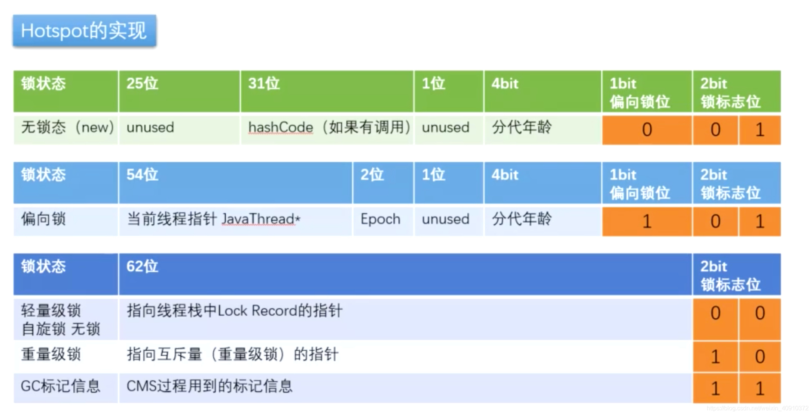
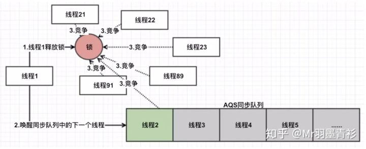
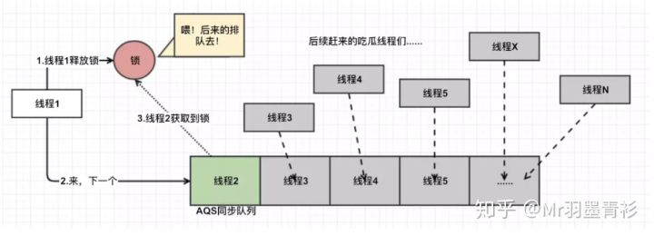

===========================   冲刺 熬住 抛开三流程序员   ===========================

# 1. 综合
1. 说说对并发编程的理解 (深信服、百度)
> 并发编程可以让优先的CPU核数，通过多个线程争夺时间片 上下文切换的方式，允许更多的程序在优先的计算资源上 并发执行，不用阻塞排队
> 但它会引来上下文切换的开销，锁竞争的开销，并发冲突的风险
> java 处理高并发任务时，采用并发编程的方式，更快地回应请求

2. 什么是线程安全？为什么不安全？ (蚂蚁*2、多益)
> 线程安全 指多个线程同时写一个对象，不需要做额外的同步或者加锁，可以获得正确的结果，那这个对象时线程安全的
> 每个线程要修改该对象，都要先从主存获取一个副本到自己的工作内存，进行修改完，再返回给主存重新赋值
> 在这个过程中，从读取-->修改-->写入，有一定的时间差，其中就有可能发生 W-W 覆盖、R-W 不可重复读、W-R 脏读 读到未提交的

3. 并发和并行的区别？(字节飞书)
> 并发执行指 多任务在同一CPU核上抢夺时间片 交替执行，java的多线程编程使用的是并发
> 并行执行指 多任务在不同的CPU核上同时执行，互不抢占CPU资源

4. 怎么把一个对象变成线程安全 / 一般怎么样才能做到线程安全？ (蚂蚁、拼多多、多益)
> 1.Synchronized, Lock加锁 限制线程访问公共变量
> 2.使用线程安全的集合 如 ConcurrentHashMap
>     使用volatile关键字修饰 或 atomic 原子类，如 AtomicInteger，保证变量可见性（直接从内存读，而不是从线程cache读），对其进行修改时使用CAS进行比较
>     如果 自定义的类 或像BigDecimal这种没有原生的原子类，可以放到AtomicReference里面进行引用

5. 手写：阻塞队列实现 或 信号量实现 多线程生产者消费者 (美团)

6. 线程状态有几种？(美团、华为、工信部电子五所、字节飞书)
> new, runnable, blocked 阻塞等待竞争获得锁, waiting等待显式唤醒, time_waiting, terminated 结束或者抛异常

7. 线程间通信的方式，wait-notify (携程、网易云音乐)
> 可以通过 synchronized 同步代码里面进行阻塞等待/唤醒，或者Lock.condition 进行线程之间的控制

8. 在Java中创建线程有哪几种方式？ (华为、工信部电子五所、京东科技、百度、京东科技)
> 3种，继承Thread 重写run方法
> Thread 构造器里面放 Runnable or Callable 实现类，可以用lambda 简写函数式接口，也可以用外部类来实现
> 由线程池submit() 提交 Runnable 和 Callable，两个函数式接口区别在于有无输出

9. 如何判断死锁，怎么避免死锁 (多益)
> 死锁的四个条件：互斥、持有和等待、没有抢占、循环等待
> 判断死锁：用 jps PID、jstack、jConsole、jvisualvm工具
> 可以通过限定时间获取锁 来避免线程的相互持有和等待、任务超时 重做等方法
>     或者设置任务优先级，如果发生死锁就低级任务让出资源
>     尽量设计按顺序获得锁，比如队列
> 实在没办法 就杀掉一个进程，需要权衡代价

10. java里面的线程和操作系统的线程一样吗？ (腾讯音乐)
> 一样，以前1.1版本 java的线程是 green thread，但1.2之后 全都用 native thread 和操作系统一样
> 绿色线程并不依赖底层的系统功能，模拟实现了多线程的运行，这种线程的管理调配发生在用户空间而不是内核空间，所以它们可以在没有原生线程支持的环境中工作
> 操作系统里面的线程状态没有 new and terminated

11. 我一个请求进来，通过隐式方式，在线程内如何隐式的传递uuid (京东)
> 

# 2. 锁
1. 在JDK升级中，synchronized 是怎么改进的
> synchronized 重量级锁底层 monitorenter 和 monitorexit 字节码的实现依赖的是操作系统的 Mutex Lock
>     由于使用 Mutex Lock 需要将当前线程挂起 并从用户态切换到内核态来执行，这种切换的代价是非常昂贵的
>     而通常线程持有锁的时间是比较短暂的，当前线程即使现在获取锁失败，但可能很快地将来就能够获取到锁，这种情况下将线程挂起是很不划算的行为
> 
> JDK1.5之前，synchronized是重量级锁，1.6以后对其进行了优化，有了一个 无锁-->偏向锁-->自旋锁-->重量级锁 的锁升级过程
> 另外 jvm会扫描看看代码片段有没有变量逃逸到方法外，如果都是方法内的变量，jvm就会把锁取消。
> 都是基于减少锁的时间 和 锁的粒度进行优化代码效率。但我们自己编码过程中，像循环内的锁 可以考虑粗化到循环外，否则反复进出会带来开销

2. synchronized 锁升级、锁降级，可重入 (有赞、京东、阿里Lazada、小米、字节飞书、美团)
[synchronized 锁升级详解](https://blog.csdn.net/weixin_40910372/article/details/107726978)
> 所谓所的升级、降级，就是JVM 优化 synchronized 的运行机制，当jvm检测到不同的竟态条件，会自动切换到合适的锁实现，这种切换情况就是锁的升级、降级

- 无锁 (偏向锁标识 = 0，锁标志 = 01)
- 偏向锁 (偏向锁标识 = 1，锁标志 = 01)
> 原理：在大部分场景都不会发生锁资源竞争，往往都是由1个线程获得锁。在这种情况下，还要通过自旋去获得锁就很多余。
>     一个线程获得无锁状态的对象，就会进入偏向锁状态。但只有遇到其他线程尝试竞争偏向锁时，持有偏向锁的线程才会释放锁，线程不会主动去释放偏向锁
> 偏向锁的升级过程：
>     1.如果是同一个线程再次请求该对象获得偏向锁，就可以直接执行代码
>     2.对象 markWord 的线程ID不是指向自己，JVM 就需要撤销(revoke)偏斜锁，并切换到轻量级锁实现，通过cas竞争锁:
>         2.1.成功就修改对象 markWord 中的线程ID，执行代码
>         2.2.当CAS到达全局安全点 (safepoint) 时获得偏向锁的线程被挂起，偏向锁升级为轻量级锁
> 偏向锁的适用场景：
>     适用于始终只有一个线程在执行同步块；在有锁的竞争时，偏向锁会多做很多额外操作，尤其是撤销偏向锁的时候会导致进入安全点，安全点会导致stw，导致性能下降，这种情况下应当禁用
>     可以使用-XX:BiasedLockingStartupDelay=0来关闭偏向锁的启动延迟, 也可以使用-XX:-UseBiasedLocking=false来关闭偏向锁

- 轻量级锁 (自旋锁)(无偏向锁标识，标志位为：00)
> JDK1.6引入自适应自旋锁，线程如果上次自旋成功了，那么这次自旋的次数会更加多；反之自旋次数减少，不浪费系统资源
> Lock Record: 在代码进入同步块的时候，如果同步对象为无锁状态，虚拟机首先将在当前线程的栈帧中建立一个Lock Record，用于存储锁对象目前的Mark Word的拷贝
> 过程：
>     1.在上述CAS竞争获得锁的时候，线程反复尝试将对象头中 markWord 的62位替换为 Lock Record 指针，
>         1.1.若成功则该线程获得锁，锁的状态依然是轻量级
>         1.2.如果**自旋一定次数**依然失败，则升级为重量级锁，指向 Lock Record 的指针也会修改成 指向互斥量，锁标志的状态值变为10，线程被挂起，后面来的线程也会直接被挂起

- 重量级锁 (无偏向锁标识，标志位为：10)
> 重量锁对象的 markWord 有一个 Monitor 对象，是实现synchronized的一个关键
> 在Java虚拟机(HotSpot)中，Monitor 对象其实就是 ObjectMonitor 对象，这个对象是一个C++对象，定义在虚拟机源码中。Monitor 有4个属性：
>     _count 计数器 记录获得所的次数用来实现重入锁机制
>     _owner 当前锁持有的线程
>     _WaitSet 调用了wait() 等待被唤醒的队列
>     _EntryList 申请锁对象的队列
> 获得锁过程：
>     1.如果是重量级锁，则申请获得Monitor，如果_count=0 就可以直接获取：把_owner改成自己，_count+1；_count != 0的话，就看看_owner是不是自己(可重入)
>     2.如果_count != 0，_owner也不是自己，就进入 _EntryList 等待锁资源释放
>     3.其中，线程调用了notify/notifyAll() 会唤醒 _WaitSet 队列中的对象

- 锁的降级
> 等待全局安全点，如果当前没有字节码正在执行，JVM 就会试图降级
> 例如 在偏向锁状态的对象上，JVM 会首先暂停拥有偏向锁的线程，判断锁对象是否处于被锁定状态，撤销偏向锁后，可能恢复到无锁状态（标志位为“01”）或升级到轻量级锁（标志位为“00”）的状态

- 可重入
> 在线程尝试向 偏向锁、轻量级锁、重量级锁获得锁的时候，都会先判断markWord 的 线程ID, LockRecord, _owner 是不是指向自己线程

3. synchronized 和 lock 的区别，lock是公平吗 (携程、京东)
> synchronized 不可中断，lock 可中断更灵活，Lock 还能知道线程是否成功获取锁，等待时间过长的话可以中断
> Lock 可以分开处理 读和写操作的冲突
> 当竞争资源非常激烈时，Lock 的性能会更好
> Lock 可设置为公平锁，按照请求锁的顺序分配锁。而 synchronized 是非公平的
> Lock 可以和条件变量 Condition 配合使用 更加灵活，对共享数据的多种状态进行监控

4. Java 里面的锁有哪些，用过哪些？(京东科技、京东)
> 可以按照一下7种分类标准：
>     偏向锁/轻量级锁/重量级锁：synchronized 锁升级策略
>     可重入锁/非可重入锁：如果获得完锁，用完之后 加入没有其他线程竞争锁，是否可以直接重新获得锁来执行代码
>     共享锁/独占锁：上锁后 还能不能加其他锁。对比：共享锁 可以并发读，但不能并发写；乐观锁 用CAS并发读，读取的数据不是实时的但最终一致
>     公平锁/非公平锁：线程竞争锁的时候是否需要排队
>     悲观锁/乐观锁：修改时是否需要 “独占” 该对象，乐观锁就可以利用CAS不占有对象来修改
>     自旋锁/非自旋锁：获取不到的话会不会一直循环获取
>     可中断锁/不可中断锁：一旦线程申请了锁，只能等到拿到锁以后才能进行其他的逻辑处理。其中 synchronized 不可中断，ReentrantLock 的 lockInterruptibly()可中断

5. 说说为什么需要可重入锁？(有赞、字节番茄、字节飞书、京东)
> 因为线程有可能需要多次进入临界区。如果每次进入都要通过CAS 或者 更重的操作会让代码变得低效

6. ReentrantLock 的实现原理、AQS？ (京东科技、字节番茄、美团、小米)4
[ReentrantLock 详解](https://zhuanlan.zhihu.com/p/82992473)
> ReentrantLock 里面的重要变量 sync 是继承 AQS，重入锁的很多功能都基于AQS实现，例如获得锁和释放锁 限时获得锁 中断等，默认 ReentrantLock 是非公平的
- 非公平锁
> 尝试 CAS(0,1) 获得锁，成功修改的话改变 占有线程ID；CAS 失败的话说明 state=1 有线程占有着，就调用 acquire(1)
>     在把线程加到等待同步队列中等待之前 (addWaiter)，再次尝试获取锁 (CAS+可重入判断) tryAcquire(arg)
> 在释放锁的时候，调用unlock() -> sync.release(1) -> 在队列不为空的情况，unparkSuccessor() 拉取一个出来和其他正在CAS的线程竞争

- 公平锁
> 差别在于 tryAcquire() 里面会判断队列里面是否还有线程在等待，如果有 它就排队到最后，如果没有才可以 继续上述的 CAS+可重入判断
> 释放的时候一样从同步队列里面抽一个出来

7. 从可重入锁出发，写出基于可重入锁的阻塞队列，怎么实现 (美团)
> 设置一个volatile 修饰的state 表示是否有线程占有，和 tread 指向占有的线程ID
> 获取锁的时候先CAS一下，如果拿不到锁就 判断 锁是否有线程占有，如果有 是不是自己，如果不是自己就加到队列排队
> 释放锁的话 从阻塞队列中抽一个出来 CAS 参与竞争
> 如果是 公平锁的话，在获取的时候要判断一下阻塞队列里面是否有线程在等待，有的话它要排队而不是直接参与竞争

8. Java 有哪些同步方案，如果不加锁呢，加锁会不会太重了 (字节番茄小说)
> 加锁 synchronized, Lock
> 信号量 ？

# 3. 线程安全 Collections
1. 有哪些线程安全的集合类，讲一讲原理 (美团优选)
> HashTable，ConcurrentHashMap 都是HashMap的线程安全的实现，区别在于 ConcurrentHashMap 通过xxx来实现线程安全相对高效
> CopyOnWriteArrayList
> BlockingQueue

2. ConcurrentHashMap
   1. HashMap是线程安全的吗？为什么呢？ (蚂蚁、美团、陌陌、京东)
   > JDK1.7的时候扩容做数据迁移的时候 可能会引起数据丢失和链表成环，导致put get的时候进入死循环
   > 另外，put的时候两个线程插入同一个哈希桶也有可能造成冲突
   
   2. 如何让 HashMap 线程安全 (蚂蚁、陌陌、小米)
   > Collections.synchronizedMap() 对 HashMap 线程不安全的方法使用synchronized进行封装，锁住的是对象相对低效
   > HashTable 也是锁着整个实例，比 ConcurrentHashMap 低效
   > ConcurrentHashMap 使用CAS乐观锁，按哈希桶来锁 相对高效

   3. ConcurrentHashMap 为什么是线程安全的？ (蚂蚁、拼多多、小米、京东)
   > 首先，Node的指针和值都用volatile修饰，保证可见性，一个线程修改，另外一个线程马上能看到
   > JDK1.8里面 是通过 CAS + synchronized 在put中实现线程安全，而get操作是没有加锁的 乐观锁策略
   >     CAS 用在修改实例中节点个数 和 空桶上的头结点，synchronized 用在锁住链表来put
   > 
   > 注：ConcurrentHashMap 不能有 Null 值

   4. jdk 1.8里面改进成了CAS 说一下你的理解 (小米)
   > JDK1.8之前是通过锁住 segment 来实现线程安全的，因为锁的粒度大，效率更低。

3. BlockingQueue & ConcurrentLinkedQueue
> BlockingQueue 使用 双锁 + 4 Condition 实现队列容量满了后 put 会阻塞，空的话 take 阻塞，offer poll 可以设置等待时间。适合做大部分生产与消费者场景
> ConcurrentLinkedQueue 使用 CAS 实现，可以让消费者马上获取消费结果 而不是阻塞等待，适用于并发不是特别激烈的那种

4. 让 ArrayList 线程安全的方法
> Vector
> Collections.synchronized()
> CopyOnWriteArrayList

5. CopyOnWriteArrayList 如何实现线程安全
> CopyOnWrite 策略：写的时候 先复制一份副本，在副本上写，再将原来的数组指向新数组。整个写操作都在 ReentrantLock 里面进行
> 缺点：
>     1.过多数据的时候进行写操作会消耗双倍的内存，有可能引发young gc或者full gc
>     2.读没有加锁，不能做到实时读 但能做到最终一致性，调用set修改重新赋值回来需要时间，所以读到的有可能是旧的数组
>     3.适合读多写少的场景，慎用
> 思路：
>     1.读写分离
>     2.最终一致性
>     3.通过开辟内存空间来解决并发冲突

6. 其他 Collections
> ConcurrentSkipListMap
> ConcurrentskipListSet CopyOnWriteArraySet SkipTableSet

# 4. 原子类、CAS
1. 说说 volatile 作用和原理？怎么保证可见性的？ (蚂蚁、美团优选、小红书、小米、OPPO提前批、京东科技、京东)
> 原子性：除了在32位操作系统上的 long and double，都是具有原子性的，要么一次操作成功，要么就全失败。
>     另外，即使变量用 volatile 修饰，i++这种基于现在值进行修改的，会让volatile不生效，不具有原子性
> 
> 可见性：每个线程可能在不同的CPU上被处理，这意味着每个线程可以拷贝到不同的CPU cache中。变量每次读写都在主存中进行
>     如果有另外一个线程修改了变量的值，正在使用的线程中缓存的编程无效，会重新到主存读取
> 
> 禁止指令重排：JVM为了优化指令、提高程序运行效率，在不影响单线程程序执行结果的前提下，尽可能地提高并行度。指令重排序包括 编译器重排序 和 运行时重排序。
>     但是在多线程环境下，同时修改一个volatile修饰的变量，重排有可能会带来最终执行结果的不一样
>     通过在读和写操作前后插入 LoadLoad、StoreStore 屏障实现，屏蔽掉了JVM中必要的代码优化，所以会降低效率，在必要时才使用
- 禁止指令重排
> 现在我们分析一下为什么要在变量singleton之间加上volatile关键字。要理解这个问题，先要了解对象的构造过程，实例化一个对象其实可以分为三个步骤：
> （1）分配内存空间。
> （2）初始化对象。
> （3）将内存空间的地址赋值给对应的引用。
> 但是由于操作系统可以对指令进行重排序，所以上面的过程也可能会变成如下过程：
> （1）分配内存空间。
> （2）将内存空间的地址赋值给对应的引用。
> （3）初始化对象
> 如果是这个流程，多线程环境下就可能将一个未初始化的对象引用暴露出来，从而导致不可预料的结果。因此，为了防止这个过程的重排序，我们需要将变量设置为volatile类型的变量。

2. volatile 和 synchronized 区别 (蚂蚁)
> 使用 volatile + 循环CAS 可以在写入的时候 不用上锁，让线程间自由竞争，而同时读取数据的线程也可以不上锁，在牺牲实时性的同时 换来代码的执行效率
>     适合竞争不是太激烈 和 不要求数据的实时性 的场景，如果竞争过于激烈 大量的线程自旋会耗费很多CPU资源
> synchronized 虽然在JDK升级过程中做了很多优化，首先它不能读写操作分开处理，凡是进入同步代码块的都要获得锁
>     然后 重量级锁基于操作系统，从用户态切换到内核态会耗费很多资源，从代码效率上讲还不如 Lock，但是在并发竞争激烈的时候 代码比CAS更稳定

3. 手写：用 volatile 解决一个变量可见性 (美团)
4. 用 volatile 修饰的变量来记录访问次数，需要其他同步操作吗 (字节番茄小说)
    - 从Java内存模型JMM的角度讲volatile，说明指令中的lock前缀和将esp寄存器的值+0这个空操作
> 修改的时候需要做循环CAS操作，如果值在计算过程中杯改变需要被重新计算

6. 哪些可以保证原子性 (京东)
> 锁：synchronized, ReentrantLock
> CAS 自旋锁

7. 说说 CAS (OPPO提前批)
> CAS 本身的原理是 在修改 volatile 修饰的变量的值之前，对变量的值进行检验，符合预期值才进行修改；如果和预期值不一致说明，本线程在计算途中，该变量的值已经被修改，需要重新计算
> CAS 的设计 是对锁的一种优化策略，线程不断的 CAS 去修改值，算到成功为止，在并发不是很激烈的场景下 可以避免加锁、释放锁这种更重量级的操作
> CAS 在 JDK1.8 的 lock 和 synchronized 里面都有使用

7. CAS的ABA问题是什么，怎么解决 (字节番茄小说)
> 线程1想修改 volatile 修饰的变量值 A-->B，此时线程2 将该值 从A-->C 又有线程3 C-->A，线程1见到A符合 expectValue 就去修改，但其实此时的变量已经经过了两次修改，已经是具有不同业务意义的
> 常见用版本号去解决 AtomicStampReference 去引用原本用 volatile 修饰的变量，CAS 的时候带上 expected版本号 和 新版本号

8. CAS失败了怎么办 (小米)
> CAS 函数本身返回false，程序的设计通常是 如果CAS失败 要重新根据新的值进行计算，再进行一次修改

# 5. 线程池
[线程池](https://blog.csdn.net/HY1273383167/article/details/117414280)
1. 介绍下线程池，讲讲为什么要有线程池 和 底层实现的原理 (京东、携程、拼多多、快手、百度提前批、有赞)
> 线程的创建和销毁有一定系统开销的，对线程的复用，可以在线程频繁创建和结束的场景 有效减少系统开销
> 对线程数量的管理，可以方式系统内存溢出
> 通过 BlockingQueue 可以实现 
> ForkJoinPool 可以让空闲的进程xxx

2. 一个任务进来后，线程池是怎么处理的？(京东科技) (看源码，待完善)
> 看池子内线程数是否已达到核心线程数，未则开启新线程
> 如果达到了，就进入队列
> 如果队列已满，就继续开启新线程，直到池子内线程数达到最大线程数，就触发拒绝策略

3. 线程池哪几种？分别说一下 (京东科技)
   > 主要分为 ThreadPoolExecutor, ScheduledThreadPoolExecutor, ForkJoinPool 三种
   > 在 jdk 在 Executors 里面提供一些默认的实现方法，但是灵活性很低 而且会内存溢出，例如
   >     1.newSingleThreadExecutor, newFixedThreadPool 中使用的 LinkedBlockingQueue 没有设置容量，会出现过多的任务阻塞
   >     2.newCachedThreadPool 中 的最大线程数 Integer.MAX_VALUE 也会导致OOM
   > 所以阿里开发手册建议程序员自己熟悉参数 根据具体业务场景去灵活使用

4. 参数 (携程、快手、蚂蚁、百度、京东)
   1. 核心线程数与最大线程数之间的关系？(蚂蚁)
   > 1.当线程数 < 核心线程数时，创建线程
   > 2.当线程数 >= 核心线程数，将任务放入任务队列 (队列未满)
   > 3.任务队列已满的话，若线程数 < 最大线程数，创建新的线程；若线程数达到最大线程数，触发拒绝策略 (默认abort策略 拒绝任务 抛出异常)

   2. BlockingQueue 有哪些
   > SynchronousQueue 同步队列，每执行一个插入，需要一个take 才能被唤醒
   > ArrayBlockingQueue 有界数组队列，1 锁 + 2 Condition，FIFO，支持公平和非公平锁
   > LinkedBlockingQueue 可无界链表队列，2 锁 + 2 Condition 效率更优，FIFO，非公平锁
   > PriorityBlockingQueue (无界 数组)优先队列，每插入一个任务，都自动按照优先级在队列中排序

   3. 自定义线程池的最大线程数如何设定 (多益)
   > 处理CPU密集型就 核数 * 2，IO密集型的任务就 核心任务数 * 2

   4. 拒绝策略 (拼多多、京东科技)
   > 1.CallerRunsPolicy - 交给调用者执行，如果大量任务提交给main程序去运行会导致阻塞 损耗性能
   > 2.DiscardPolicy - 丢弃
   > 3.AbortPolicy - 丢弃 并抛异常，默认
   > 4.DiscardOldestPolicy - 丢弃最老的 任务
   
5. ForkJoinPool
   1. 了解Java的线程池吗？里面有一个ForkJoinPool，有没有用过？说一下 (阿里Lazada)
   > ForkJoinPool 把大任务 (fork) 分成一个个小任务，对于一些计算密集型任务来说 可以提高执行效率，充分利用CPU资源
   > JDK8中的并行流 parallelStream 是基于ForkJoinPool实现的，另外还有java.util.concurrent.CompletableFuture异步回调future，内部使用的线程池也是ForkJoinPool

   2. ForkJoinPool 和 其他的线程池有什么不一样的地方吗？比如用到了哪些算法 (阿里Lazada)
   > 可以说它是对普通线程池在计算密集型场景的补充，充分压榨CPU性能 来加快大任务处理速度
   > 它可以从其他线程的任务队列尾部 窃取未完成的任务来执行，而 ThreadPoolExecutor 不行
   > ForkJoinPool 里面每个线程都有一个自己的双向队列，而 ThreadPoolExecutor 所有线程共用一个BlockingQueue

6. 线程池会造成 oom 内存泄漏吗？(蚂蚁)
> 除了队列长度 和 最大线程数不做限制，在高并发场景下可能会引发OOM
> 使用 ThreadLocal 不当也会引来OOM 
>     ThreadLocal 本身并不存值，它只是作为一个 key 来让线程从 ThreadLocalMap 获取值；换句话说，ThreadLocalMap 是使用 ThreadLocal 的弱引用作为 Key，弱引用在GC时会被回收
>     当线程不结束的话，这些 key为null 的 Entry的value 就会一直存在一条强引用链，永远无法回收
>     最好每次使用完 ThreadLocal 都调用remove()清除掉 ThreadLocalMap 中不再使用的数据

7. beforeExecute，afterExecute，terminated 三个AOP操作，还可以实现日志、释放资源等操作
8. [阿里技术：10问10答](https://blog.csdn.net/HY1273383167/article/details/117414280)
   1. [一个线程池中的线程异常了，那么线程池会怎么处理这个线程?](https://www.modb.pro/db/150813)
   > 用 execute() 执行的话会抛出堆栈异常，但如果用 submit() 的话会将Exception保存起来 不抛出；submit()之后，如果 get() 获取执行结果，也会报错
   > 会调用 processWorkerExit 把任务从线程池中移除；并不影响其他线程执行

   2. corePoolSize=0会怎么样
   > 在JDK1.6之后，如果corePoolSize=0，提交任务时如果线程池为空，则会立即创建一个线程来执行任务(先排队再获取)；如果提交任务的时候，线程池不为空，则先在等待队列中排队，只有队列满了才会创建新线程
   > 1.6 之前是队列满了之后才会有线程来消费

   3. 线程池创建之后，会立即创建核心线程么
   > 不会，来新任务才会开始创建线程。除非调用 prestartCoreThread / prestartAllCoreThreads 方法提前开启线程，试用于秒杀那种瞬时流量爆发的场景

   4. 核心线程永远不会销毁么
   > 首先，核心线程并没有被打上标识来区分线程
   > 其次，在JDK1.6之前，线程池会尽量保持corePoolSize个核心线程，即使这些线程闲置了很长时间。
   > 这一点曾被开发者诟病，所以从JDK1.6开始，提供了方法allowsCoreThreadTimeOut，如果传参为true，则允许闲置的核心线程被终止

   5. 如何保证线程不被销毁
   > 核心线程的 Worker 即使一直空闲也不终止，是通过workQueue.take()实现的，它会一直阻塞到从等待队列中取到新的任务
   > 非核心线程空闲指定时间后终止是通过workQueue.poll(keepAliveTime, TimeUnit.NANOSECONDS)实现的，一个空闲的Worker只等待keepAliveTime，如果还没有取到任务则循环终止，线程也就运行结束了

   6. 空闲线程过多会有什么问题
   > 线程池 保持一定数量的核心线程是它的默认配置，一般来讲是没有问题的，因为它占用的内存一般不大。怕的就是业务代码中使用ThreadLocal缓存的数据过大又不清理。
   > 如果你的应用线程数处于高位，新的线程初始化可能因为 Eden 没有足够的空间分配 TLAB 而触发 YoungGC
   > 需要观察一下估算一下 Eden 大小是否足够。如果不够的话，可能要谨慎地创建新线程，并且让空闲的线程终止；必要的时候，可能需要对JVM进行调参。

   7. keepAliveTime=0会怎么样
   > JDK1.8中，keepAliveTime = 0 表示非核心线程执行完立刻终止
   > 注：初始化的时候报错：keepAliveTime < 0； 如果 allowsCoreThreadTimeOut，keepAliveTime必须 > 0
   
   8. 怎么进行异常处理
   > 如果用 submit() 提交，FutureTask 里面对异常进行了捕捉，并封装到outcome里面，就对 Future 使用 get() 异步获取对象的代码时套 try..catch
   > 如果用 execute() 执行，重写 afterExecute 捕捉，或者实现 Thread.UncaughtExceptionHandler 丢到 uncaughtException() 方法，并将该handler传递给线程池的ThreadFactory

   9. 线程池需不需要关闭
   > 一般来讲，线程池的生命周期跟随服务的生命周期，ExecutorService.shutdown 通常写在服务的shutdown方法里面，像数据库的连接池

   10. shutdown和shutdownNow的区别
   > 前者等所有任务执行完再关闭，不再接受新任务；后者立即关闭，并返回队列中未执行完的任务

   11. Spring中有哪些和ThreadPoolExecutor类似的工具
   > @Async 注解底层用的是 SimpleAsyncTaskExecutor，没有最大线程数，线程不服用 每次调用都会重开一个
   > SyncTaskExecutor 同步任务执行器，因为不异步，所以严格来说不太算是线程池
   > ConcurrentTaskExecutor Executor的适配类，不推荐使用。如果 ThreadPoolTaskExecutor 不满足要求时，才用考虑使用这个类。
   > SimpleThreadPoolTaskExecutor 监听Spring’s lifecycle callbacks，并且可以和Quartz的Component兼容.是Quartz的SimpleThreadPool的类。线程池同时被quartz和非quartz使用，才需要使用此类。

10. tomcat的线程模型？tomcat线程池如何实现？(蚂蚁)
11. tomcat servlet接收请求流程 (有赞)

# 6. 辅助类
1. CountDownLatch 你知道吗？说一下。Semaphore 信号量呢？ (阿里Lazada、京东)
- CountDownLatch 倒计时计数器
> ，不像 Semaphore 能通过release来恢复，CountDownLatch 的 countDown()是一直数到0 不可恢复的
>     配合await(时长，单位) 在main program中控制，直到 CountDownLatch 数到0，再停止阻塞，否则线程 和 main 程序是一起执行的
>     AOP功能：在开启多个线程的时候，可以用作启动信号 和 结束信号，或第N的线程执行完要做的操作 
>     还可以用在 并发调试场景

- CyclicBarrier 栅栏
> 和 CountDownLatch 相似，通过阻塞的方法 凑齐指定数量的线程才能一起执行，其底层通过RecentLock实现的
>     有 generation 的概念，一个 generation 的线程放行之后 会自动重置重新计算，这时候和 CountDownLatch 不一样的

- Semaphore 信号量
> 核心作用是控制某个资源 只能同时被访问的线程数，即线程的调度。构造参数可以设置是否公平，通常情况下 Semaphore(0) 先释放再获取
> 和使用 Lock 的却别
>     1.lock只能让一个线程获得锁，而 Semaphore 允许多个线程
>     2.可以通过一个非owner线程防止死锁，因为 unlock() 需要先获取锁，Semaphore 即使初始化permit=0，也可以调用 release() 来增加 permits
> 与线程池的区别
>     1.线程池的线程实际工作由线程池创建，而 Semaphore 由程序员手动创建
>     2.Semaphore需要通过acquire() release() 来控制线程获得执行权限，而线程池自动管理
>     3.线程池可以实现超时和异步访问，通过提交一个Callable对象获得Future，从而可以在需要时调用Future的方法获得线程执行的结果，同样利用Future也可以实现超时；Semaphore不支持

- 待补充：三个辅助类的底层实现，具体场景

2. CompletableFuture 你知道吗？ (阿里Lazada)
> 异步线程，基于 Future 进行拓展
> 相比 Future 阻塞主线程去获取 Callable 计算结果，即使可以设置超时，但 CompletableFuture 开启异步线程可以避免阻塞主线程
> 适用于执行非常耗时，不希望主线程阻塞等待的场景。或者多个任务之间有依赖 和 合并计算的
> 提供了异步任务的异常管理机制，还提供 CompletionStage：转换（thenCompose）、组合（thenCombine）、消费（thenAccept）、运行（thenRun）。、带返回的消费（thenApply）
> 
> 测试多线程的小伙伴请勿使用JUit单元测试，JUnit在主线程完成之后就会关闭JVM

3. 其他
   1. 什么是伪共享,为何会出现，以及如何避免？
   2. 什么是可重入锁、乐观锁、悲观锁、公平锁、非公平锁、独占锁、共享锁？
   3. ThreadLocal
      1. 讲讲ThreadLocal 的实现原理
      2. ThreadLocal 作为变量的线程隔离方式，其内部是如何做的？
      3. 说说InheritableThreadLocal 的实现原理？
      4. InheritableThreadLocal 是如何弥补 ThreadLocal 不支持继承的特性？
      5. ThreadLocalRandom 是如何利用 ThreadLocal 的原理来解决 Random 的局限性？
      6. Spring 框架中如何使用 ThreadLocal 实现 request scope 作用域 Bean？
   4. CyclicBarrier
      1. 讲讲 CyclicBarrier 回环屏障的使用？
      2. CyclicBarrier 内部的实现与 CountDownLatch 有何不同？
   5. CountDownLatch
      1. 分析下JUC 中倒数计数器 CountDownLatch 的使用与原理？
      2. CountDownLatch 与线程的 Join 方法区别是什么？
   6. 随机数生成器 Random 类如何使用 CAS 算法保证多线程下新种子的唯一性？
   7. StampedLock 锁原理的理解？
   8. 谈下对基于链表的非阻塞无界队列 ConcurrentLinkedQueue 原理的理解
   9. PriorityBlockingQueue 内部使用堆算法保证每次出队都是优先级最高的元素，元素入队时候是如何建堆的，元素出队后如何调整堆的平衡的
   10. Semaphore 的内部实现是怎样的？
   11. 简单对比同步器实现，谈谈你的看法？
   12. 并发组件CopyOnWriteArrayList 是如何通过写时拷贝实现并发安全的 List？

# 问题
[CSDN - 多线程](https://blog.csdn.net/white_pure/article/details/116860559?utm_medium=distribute.pc_aggpage_search_result.none-task-blog-2~aggregatepage~first_rank_ecpm_v1~rank_v31_ecpm-1-116860559-null-null.pc_agg_new_rank&utm_term=%E5%9C%A8%E7%BA%BF%E7%A8%8B%E5%86%85%E5%A6%82%E4%BD%95%E9%9A%90%E5%BC%8F%E7%9A%84%E4%BC%A0%E9%80%92uuid&spm=1000.2123.3001.4430)
1. 综合 11
3. 线程安全Collections
   - 6 其他Collections
5. 线程池
   - tomcat 线程池
   - 底层代码是怎么提交任务的，execute() 和 submit() 的区别
6. 辅助类
   - 1 底层实现；2 CompletableFuture 异步

- 回头再看：分布式锁、其他Collections、tomcat 线程池、辅助类底层实现、异步
- 还得自己梳理一下：
  - 乐观/悲观锁 与 共享/独占锁
  - 
- 重点问题 复习：
  - synchronized 实现 锁 的底层实现
  - 线程安全collection底层实现
  - 线程池