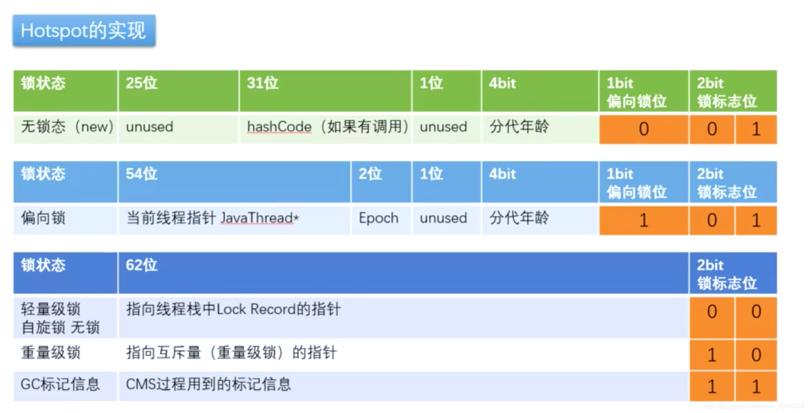
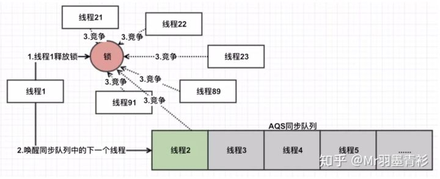
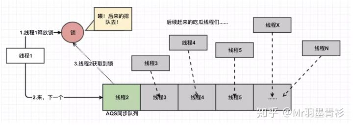

===========================   冲刺 熬住 抛开三流程序员   ===========================
# 一、多线程

## 1. 综合
1. 说说对并发编程的理解 (深信服、百度)
> 并发编程可以让优先的CPU核数，通过多个线程争夺时间片 上下文切换的方式，允许更多的程序在优先的计算资源上 并发执行，不用阻塞排队
> 但它会引来上下文切换的开销，锁竞争的开销，并发冲突的风险
> java 处理高并发任务时，采用并发编程的方式，更快地回应请求

2. 什么是线程安全？为什么不安全？ (蚂蚁*2、多益)
> 

3. 并发和并行的区别？(字节飞书)
> 并发执行指 多任务在同一CPU核上抢夺时间片 交替执行，java的多线程编程使用的是并发
> 并行执行指 多任务在不同的CPU核上同时执行，互不抢占CPU资源

4. 怎么把一个对象变成线程安全 / 一般怎么样才能做到线程安全？ (蚂蚁、拼多多、多益)
> 1.加锁让公共变量同步 Synchronized, Lock
> 2.使用线程安全的集合 如 ConcurrentHashMap
>     使用volatile关键字修饰 或 atomic 原子类，如 AtomicInteger，保证变量可见性（直接从内存读，而不是从线程cache读），对其进行修改时使用CAS进行比较
>     如果 自定义的类 或像BigDecimal这种没有原生的原子类，可以放到AtomicReference里面进行引用

4. 手写：阻塞队列实现 或 信号量实现 多线程生产者消费者 (美团)

5. 线程状态有几种？(美团、华为、工信部电子五所、字节飞书)
> new, runnable, blocked 阻塞等待竞争获得锁, waiting等待显式唤醒, time_waiting, terminated 结束或者抛异常

6. 线程间通信的方式，wait-notify (携程、网易云音乐)
> 可以通过 synchronized 同步代码里面进行阻塞等待/唤醒，或者Lock.condition 进行线程之间的控制

7. 在Java中创建线程有哪几种方式？ (华为、工信部电子五所、京东科技、百度、京东科技)
> 3种，继承Thread 重写run方法
> Thread 构造器里面放 Runnable or Callable 实现类，可以用lambda 简写函数式接口，也可以用外部类来实现
> 由线程池submit() 提交 Runnable 和 Callable，两个函数式接口区别在于有无输出

8. 如何判断死锁，怎么避免死锁 (多益)
9. java里面的线程和操作系统的线程一样吗？ (腾讯音乐)
10. CompletableFuture 你知道吗？ (阿里Lazada)
> 开启异步线程

11. 我一个请求进来，通过隐式方式，在线程内如何隐式的传递uuid (京东)
12. CountDownLatch你知道吗？说一下。信号量呢？ (阿里Lazada、京东)
    - 在什么场景用过，减是用什么方法 (京东)

13. 其他
    1. 什么是伪共享,为何会出现，以及如何避免？
    2. 什么是可重入锁、乐观锁、悲观锁、公平锁、非公平锁、独占锁、共享锁？
    3. ThreadLocal
       1. 讲讲ThreadLocal 的实现原理
       2. ThreadLocal 作为变量的线程隔离方式，其内部是如何做的？
       3. 说说InheritableThreadLocal 的实现原理？
       4. InheritableThreadLocal 是如何弥补 ThreadLocal 不支持继承的特性？
       5. ThreadLocalRandom 是如何利用 ThreadLocal 的原理来解决 Random 的局限性？
       6. Spring 框架中如何使用 ThreadLocal 实现 request scope 作用域 Bean？
    4. CyclicBarrier
       1. 讲讲对JUC 中回环屏障 CyclicBarrier 的使用？
       2. CyclicBarrier 内部的实现与 CountDownLatch 有何不同？
    5. CountDownLatch
       1. 分析下JUC 中倒数计数器 CountDownLatch 的使用与原理？
       2. CountDownLatch 与线程的 Join 方法区别是什么？
    6. 随机数生成器 Random 类如何使用 CAS 算法保证多线程下新种子的唯一性？
    7. StampedLock 锁原理的理解？
    8. 谈下对基于链表的非阻塞无界队列 ConcurrentLinkedQueue 原理的理解
    9. PriorityBlockingQueue 内部使用堆算法保证每次出队都是优先级最高的元素，元素入队时候是如何建堆的，元素出队后如何调整堆的平衡的
    10. Semaphore 的内部实现是怎样的？
    11. 简单对比同步器实现，谈谈你的看法？
    12. 并发组件CopyOnWriteArrayList 是如何通过写时拷贝实现并发安全的 List？

## 2. 锁
1. 在JDK升级中，synchronized 是怎么改进的
> synchronized 重量级锁底层 monitorenter 和 monitorexit 字节码的实现依赖的是操作系统的 Mutex Lock
>     由于使用 Mutex Lock 需要将当前线程挂起 并从用户态切换到内核态来执行，这种切换的代价是非常昂贵的
>     而通常线程持有锁的时间是比较短暂的，当前线程即使现在获取锁失败，但可能很快地将来就能够获取到锁，这种情况下将线程挂起是很不划算的行为
> 
> JDK1.5之前，synchronized是重量级锁，1.6以后对其进行了优化，有了一个 无锁-->偏向锁-->自旋锁-->重量级锁 的锁升级过程
> 另外 jvm会扫描看看代码片段有没有变量逃逸到方法外，如果都是方法内的变量，jvm就会把锁取消。
> 都是基于减少锁的时间 和 锁的粒度进行优化代码效率。但我们自己编码过程中，像循环内的锁 可以考虑粗化到循环外，否则反复进出会带来开销

2. synchronized 锁升级、锁降级，可重入 (有赞、京东、阿里Lazada、小米、字节飞书、美团)
[synchronized 锁升级详解](https://blog.csdn.net/weixin_40910372/article/details/107726978)
> 所谓所的升级、降级，就是JVM 优化 synchronized 的运行机制，当jvm检测到不同的竟态条件，会自动切换到合适的锁实现，这种切换情况就是锁的升级、降级

- 无锁 (偏向锁标识 = 0，锁标志 = 01)
- 偏向锁 (偏向锁标识 = 1，锁标志 = 01)
> 原理：在大部分场景都不会发生锁资源竞争，往往都是由1个线程获得锁。在这种情况下，还要通过自旋去获得锁就很多余。
>     一个线程获得无锁状态的对象，就会进入偏向锁状态。但只有遇到其他线程尝试竞争偏向锁时，持有偏向锁的线程才会释放锁，线程不会主动去释放偏向锁
> 偏向锁的升级过程：
>     1.如果是同一个线程再次请求该对象获得偏向锁，就可以直接执行代码
>     2.对象 markWord 的线程ID不是指向自己，JVM 就需要撤销(revoke)偏斜锁，并切换到轻量级锁实现，通过cas竞争锁:
>         2.1.成功就修改对象 markWord 中的线程ID，执行代码
>         2.2.当CAS到达全局安全点 (safepoint) 时获得偏向锁的线程被挂起，偏向锁升级为轻量级锁
> 偏向锁的适用场景：
>     适用于始终只有一个线程在执行同步块；在有锁的竞争时，偏向锁会多做很多额外操作，尤其是撤销偏向锁的时候会导致进入安全点，安全点会导致stw，导致性能下降，这种情况下应当禁用
>     可以使用-XX:BiasedLockingStartupDelay=0来关闭偏向锁的启动延迟, 也可以使用-XX:-UseBiasedLocking=false来关闭偏向锁

- 轻量级锁 (自旋锁)(无偏向锁标识，标志位为：00)
> JDK1.6引入自适应自旋锁，线程如果上次自旋成功了，那么这次自旋的次数会更加多；反之自旋次数减少，不浪费系统资源
> Lock Record: 在代码进入同步块的时候，如果同步对象为无锁状态，虚拟机首先将在当前线程的栈帧中建立一个Lock Record，用于存储锁对象目前的Mark Word的拷贝
> 过程：
>     1.在上述CAS竞争获得锁的时候，线程反复尝试将对象头中 markWord 的62位替换为 Lock Record 指针，
>         1.1.若成功则该线程获得锁，锁的状态依然是轻量级
>         1.2.如果**自旋一定次数**依然失败，则升级为重量级锁，指向 Lock Record 的指针也会修改成 指向互斥量，锁标志的状态值变为10，线程被挂起，后面来的线程也会直接被挂起

- 重量级锁 (无偏向锁标识，标志位为：10)
> 重量锁对象的 markWord 有一个 Monitor 对象，是实现synchronized的一个关键
> 在Java虚拟机(HotSpot)中，Monitor 对象其实就是 ObjectMonitor 对象，这个对象是一个C++对象，定义在虚拟机源码中。Monitor 有4个属性：
>     _count 计数器 记录获得所的次数用来实现重入锁机制
>     _owner 当前锁持有的线程
>     _WaitSet 调用了wait() 等待被唤醒的队列
>     _EntryList 申请锁对象的队列
> 获得锁过程：
>     1.如果是重量级锁，则申请获得Monitor，如果_count=0 就可以直接获取：把_owner改成自己，_count+1；_count != 0的话，就看看_owner是不是自己(可重入)
>     2.如果_count != 0，_owner也不是自己，就进入 _EntryList 等待锁资源释放
>     3.其中，线程调用了notify/notifyAll() 会唤醒 _WaitSet 队列中的对象

- 锁的降级
> 等待全局安全点，如果当前没有字节码正在执行，JVM 就会试图降级
> 例如 在偏向锁状态的对象上，JVM 会首先暂停拥有偏向锁的线程，判断锁对象是否处于被锁定状态，撤销偏向锁后，可能恢复到无锁状态（标志位为“01”）或升级到轻量级锁（标志位为“00”）的状态

- 可重入
> 在线程尝试向 偏向锁、轻量级锁、重量级锁获得锁的时候，都会先判断markWord 的 线程ID, LockRecord, _owner 是不是指向自己线程

3. synchronized 和 lock 的区别，lock是公平吗 (携程、京东)
> synchronized 不可中断，lock 可中断更灵活，Lock 还能知道线程是否成功获取锁，等待时间过长的话可以中断
> Lock 可以分开处理 读和写操作的冲突
> 当竞争资源非常激烈时，Lock 的性能会更好
> Lock 可设置为公平锁，按照请求锁的顺序分配锁。而 synchronized 是非公平的
> Lock 可以和条件变量 Condition 配合使用 更加灵活，对共享数据的多种状态进行监控

4. Java 里面的锁有哪些，用过哪些？(京东科技、京东)
> 可以按照一下7种分类标准：
>     偏向锁/轻量级锁/重量级锁：synchronized 锁升级策略
>     可重入锁/非可重入锁：如果获得完锁，用完之后 加入没有其他线程竞争锁，是否可以直接重新获得锁来执行代码
>     共享锁/独占锁：上锁后 还能不能加其他锁
>     公平锁/非公平锁：线程竞争锁的时候是否需要排队
>     悲观锁/乐观锁：修改时是否需要 “独占” 该对象，乐观锁就可以利用CAS不占有对象来修改
>     自旋锁/非自旋锁：获取不到的话会不会一直循环获取
>     可中断锁/不可中断锁：一旦线程申请了锁，只能等到拿到锁以后才能进行其他的逻辑处理。其中 synchronized 不可中断，ReentrantLock 的 lockInterruptibly()可中断

5. 说说为什么需要可重入锁？(有赞、字节番茄、字节飞书、京东)
> 因为线程有可能需要多次进入临界区。如果每次进入都要通过CAS 或者 更重的操作会让代码变得低效

6. ReentrantLock 的实现原理、AQS？ (京东科技、字节番茄、美团、小米)4
[ReentrantLock 详解](https://zhuanlan.zhihu.com/p/82992473)
> ReentrantLock 里面的重要变量 sync 是继承 AQS，重入锁的很多功能都基于AQS实现，例如获得锁和释放锁 限时获得锁 中断等，默认 ReentrantLock 是非公平的
- 非公平锁
> 尝试 CAS(0,1) 获得锁，成功修改的话改变 占有线程ID；CAS 失败的话说明 state=1 有线程占有着，就调用 acquire(1)
>     在把线程加到等待同步队列中等待之前 (addWaiter)，再次尝试获取锁 (CAS+可重入判断) tryAcquire(arg)
> 在释放锁的时候，调用unlock() -> sync.release(1) -> 在队列不为空的情况，unparkSuccessor() 拉取一个出来和其他正在CAS的线程竞争

- 公平锁
> 差别在于 tryAcquire() 里面会判断队列里面是否还有线程在等待，如果有 它就排队到最后，如果没有才可以 继续上述的 CAS+可重入判断
> 释放的时候一样从同步队列里面抽一个出来

7. Java 有哪些同步方案，如果不加锁呢，加锁会不会太重了 (字节番茄小说)
> 加锁 synchronized, Lock
> 信号量 ？

8. 项目中锁的应用，分布式锁 (快手)
> 

## 3. 线程安全 Collections
1. 有哪些线程安全的集合类，讲一讲原理 (美团优选)
> HashTable，ConcurrentHashMap 都是HashMap的线程安全的实现，区别在于 ConcurrentHashMap 通过xxx来实现线程安全相对高效
> CopyOnWriteArrayList
> BlockingQueue

2. ConcurrentHashMap
   1. HashMap是线程安全的吗？为什么呢？ (蚂蚁、美团、陌陌、京东)
   > JDK1.7的时候扩容做数据迁移的时候 可能会引起数据丢失和链表成环，导致put get的时候进入死循环
   > 另外，put的时候两个线程插入同一个哈希桶也有可能造成冲突
   2. 如何让 HashMap 线程安全 (蚂蚁、陌陌、小米)
   > Collections.synchronizedMap() 对 HashMap 线程不安全的方法大量使用synchronized进行封装，锁住的是对象相对低效
   > ConcurrentHashMap 使用CAS乐观锁，而且按哈希桶来锁 相对高效
   3. ConcurrentHashMap为什么是线程安全的？ (蚂蚁、拼多多、小米、京东)
       - 通过 cas + synchronized 实现，线程操作前 先判断刚才是否有人在扩容或者在修改这个桶的数据
       - 
   4. jdk 1.8里面改进成了CAS 说一下你的理解 (小米)
3. BlockingQueue
    1. 从可重入锁出发，写出基于可重入锁的阻塞队列，怎么实现 (美团)

## 4. 原子类、CAS
1. 说说 volatile 作用和原理？怎么保证可见性的？ (蚂蚁、美团优选、小红书、小米、OPPO提前批、京东科技、京东)
2. volatile 和 synchronized 区别 (蚂蚁)
3. 写出volatile解决可见性的代码 (美团)
4. 用volatile修饰的变量来记录访问次数，需要其他同步操作吗 (字节番茄小说)
    - 从Java内存模型JMM的角度讲volatile，说明指令中的lock前缀和将esp寄存器的值+0这个空操作
5. 哪些可以保证原子性，CAS做乐观锁吧 (京东)
6. 说说 CAS (OPPO提前批)
7. CAS的ABA问题是什么，怎么解决 (字节番茄小说)
8. CAS失败了怎么办 (小米)

## 5. 线程池
[线程池](https://blog.csdn.net/HY1273383167/article/details/117414280)
1. 介绍下线程池，讲讲为什么要有线程池 和 底层实现的原理 (京东、携程、拼多多、快手、百度提前批、有赞)
> 线程的创建和销毁有一定系统开销的，对线程的复用，可以在线程频繁创建和结束的场景 有效减少系统开销
> 对线程数量的管理，可以方式系统内存溢出
> 通过 BlockingQueue 可以实现 
> ForkJoinPool 可以让空闲的进程xxx

2. 一个任务进来后，线程池是怎么处理的？(京东科技) (看源码，待完善)
> 看池子内线程数是否已达到核心线程数，未则开启新线程
> 如果达到了，就进入队列
> 如果队列已满，就继续开启新线程，直到池子内线程数达到最大线程数，就触发拒绝策略

3. 线程池哪几种？分别说一下 (京东科技)
   > 主要分为 ThreadPoolExecutor, ScheduledThreadPoolExecutor, ForkJoinPool 三种
   > 在 jdk 在 Executors 里面提供一些默认的实现方法，但是灵活性很低 而且会内存溢出，例如
   >     1.newSingleThreadExecutor, newFixedThreadPool 中使用的 LinkedBlockingQueue 没有设置容量，会出现过多的任务阻塞
   >     2.newCachedThreadPool 中 的最大线程数 Integer.MAX_VALUE 也会导致OOM
   > 所以阿里开发手册建议程序员自己熟悉参数 根据具体业务场景去灵活使用

4. 参数 (携程、快手、蚂蚁、百度、京东)
   1. 核心线程数与最大线程数之间的关系？(蚂蚁)
   > 1.当线程数 < 核心线程数时，创建线程
   > 2.当线程数 >= 核心线程数，将任务放入任务队列 (队列未满)
   > 3.任务队列已满的话，若线程数 < 最大线程数，创建新的线程；若线程数达到最大线程数，触发拒绝策略 (默认abort策略 拒绝任务 抛出异常)

   2. BlockingQueue 有哪些
   > SynchronousQueue 同步队列，每执行一个插入，需要一个take 才能被唤醒
   > ArrayBlockingQueue 有界数组队列，1 锁 + 2 Condition，FIFO，支持公平和非公平锁
   > LinkedBlockingQueue 可无界链表队列，2 锁 + 2 Condition 效率更优，FIFO，非公平锁
   > PriorityBlockingQueue (无界 数组)优先队列，每插入一个任务，都自动按照优先级在队列中排序

   3. 自定义线程池的最大线程数如何设定 (多益)
   > 处理CPU密集型就 核数 * 2，IO密集型的任务就 核心任务数 * 2

   4. 拒绝策略 (拼多多、京东科技)
   > 1.CallerRunsPolicy - 交给调用者执行，如果大量任务提交给main程序去运行会导致阻塞 损耗性能
   > 2.DiscardPolicy - 丢弃
   > 3.AbortPolicy - 丢弃 并抛异常，默认
   > 4.DiscardOldestPolicy - 丢弃最老的 任务
   
5. ForkJoinPool
   1. 了解Java的线程池吗？里面有一个ForkJoinPool，有没有用过？说一下 (阿里Lazada)
   > ForkJoinPool 把大任务 (fork) 分成一个个小任务，对于一些计算密集型任务来说 可以提高执行效率，充分利用CPU资源
   > JDK8中的并行流 parallelStream 是基于ForkJoinPool实现的，另外还有java.util.concurrent.CompletableFuture异步回调future，内部使用的线程池也是ForkJoinPool

   2. ForkJoinPool 和 其他的线程池有什么不一样的地方吗？比如用到了哪些算法 (阿里Lazada)
   > 可以说它是对普通线程池在计算密集型场景的补充，充分压榨CPU性能 来加快大任务处理速度
   > 它可以从其他线程的任务队列尾部 窃取未完成的任务来执行，而 ThreadPoolExecutor 不行
   > ForkJoinPool 里面每个线程都有一个自己的双向队列，而 ThreadPoolExecutor 所有线程共用一个BlockingQueue

6. 线程池会造成 oom 内存泄漏吗？(蚂蚁)
> 除了队列长度 和 最大线程数不做限制，在高并发场景下可能会引发OOM
> 使用 ThreadLocal 不当也会引来OOM 
>     ThreadLocal 本身并不存值，它只是作为一个 key 来让线程从 ThreadLocalMap 获取值；换句话说，ThreadLocalMap 是使用 ThreadLocal 的弱引用作为 Key，弱引用在GC时会被回收
>     当线程不结束的话，这些 key为null 的 Entry的value 就会一直存在一条强引用链，永远无法回收
>     最好每次使用完 ThreadLocal 都调用remove()清除掉 ThreadLocalMap 中不再使用的数据

7. beforeExecute，afterExecute，terminated 三个AOP操作，还可以实现日志、释放资源等操作
8. [阿里技术：10问10答](https://blog.csdn.net/HY1273383167/article/details/117414280)
   1. [一个线程池中的线程异常了，那么线程池会怎么处理这个线程?](https://www.modb.pro/db/150813)
   > 用 execute() 执行的话会抛出堆栈异常，但如果用 submit() 的话会将Exception保存起来 不抛出；submit()之后，如果 get() 获取执行结果，也会报错
   > 会调用 processWorkerExit 把任务从线程池中移除；并不影响其他线程执行

   2. corePoolSize=0会怎么样
   > 在JDK1.6之后，如果corePoolSize=0，提交任务时如果线程池为空，则会立即创建一个线程来执行任务(先排队再获取)；如果提交任务的时候，线程池不为空，则先在等待队列中排队，只有队列满了才会创建新线程
   > 1.6 之前是队列满了之后才会有线程来消费

   3. 线程池创建之后，会立即创建核心线程么
   > 不会，来新任务才会开始创建线程。除非调用 prestartCoreThread / prestartAllCoreThreads 方法提前开启线程，试用于秒杀那种瞬时流量爆发的场景

   4. 核心线程永远不会销毁么
   > 首先，核心线程并没有被打上标识来区分线程
   > 其次，在JDK1.6之前，线程池会尽量保持corePoolSize个核心线程，即使这些线程闲置了很长时间。
   > 这一点曾被开发者诟病，所以从JDK1.6开始，提供了方法allowsCoreThreadTimeOut，如果传参为true，则允许闲置的核心线程被终止

   5. 如何保证线程不被销毁
   > 核心线程的 Worker 即使一直空闲也不终止，是通过workQueue.take()实现的，它会一直阻塞到从等待队列中取到新的任务
   > 非核心线程空闲指定时间后终止是通过workQueue.poll(keepAliveTime, TimeUnit.NANOSECONDS)实现的，一个空闲的Worker只等待keepAliveTime，如果还没有取到任务则循环终止，线程也就运行结束了

   6. 空闲线程过多会有什么问题
   > 线程池 保持一定数量的核心线程是它的默认配置，一般来讲是没有问题的，因为它占用的内存一般不大。怕的就是业务代码中使用ThreadLocal缓存的数据过大又不清理。
   > 如果你的应用线程数处于高位，新的线程初始化可能因为 Eden 没有足够的空间分配 TLAB 而触发 YoungGC
   > 需要观察一下估算一下 Eden 大小是否足够。如果不够的话，可能要谨慎地创建新线程，并且让空闲的线程终止；必要的时候，可能需要对JVM进行调参。

   7. keepAliveTime=0会怎么样
   > JDK1.8中，keepAliveTime = 0 表示非核心线程执行完立刻终止
   > 注：初始化的时候报错：keepAliveTime < 0； 如果 allowsCoreThreadTimeOut，keepAliveTime必须 > 0
   
   8. 怎么进行异常处理
   > 如果用 submit() 提交，FutureTask 里面对异常进行了捕捉，并封装到outcome里面，就对 Future 使用 get() 异步获取对象的代码时套 try..catch
   > 如果用 execute() 执行，重写 afterExecute 捕捉，或者实现 Thread.UncaughtExceptionHandler 丢到 uncaughtException() 方法，并将该handler传递给线程池的ThreadFactory

   9. 线程池需不需要关闭
   > 一般来讲，线程池的生命周期跟随服务的生命周期，ExecutorService.shutdown 通常写在服务的shutdown方法里面，像数据库的连接池

   10. shutdown和shutdownNow的区别
   > 前者等所有任务执行完再关闭，不再接受新任务；后者立即关闭，并返回队列中未执行完的任务

   11. Spring中有哪些和ThreadPoolExecutor类似的工具
   > @Async 注解底层用的是 SimpleAsyncTaskExecutor，没有最大线程数，线程不服用 每次调用都会重开一个
   > SyncTaskExecutor 同步任务执行器，因为不异步，所以严格来说不太算是线程池
   > ConcurrentTaskExecutor Executor的适配类，不推荐使用。如果 ThreadPoolTaskExecutor 不满足要求时，才用考虑使用这个类。
   > SimpleThreadPoolTaskExecutor 监听Spring’s lifecycle callbacks，并且可以和Quartz的Component兼容.是Quartz的SimpleThreadPool的类。线程池同时被quartz和非quartz使用，才需要使用此类。

10. tomcat的线程模型？tomcat线程池如何实现？(蚂蚁)
11. tomcat servlet接收请求流程 (有赞)

# 问题
2. ForkJoinPool 是啥
